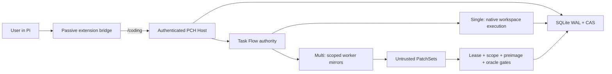

<div align="center">

# Pi Coding Harness

### Reliable, recoverable execution for Pi Coding Agent

An opt-in execution layer for durable task state, evidence-gated changes,
recoverable workflows, and isolated multi-agent coordination.

[](https://github.com/KirschBluteX/pi-coding-harness/actions/workflows/ci.yml)
[](LICENSE)

[Architecture](docs/ARCHITECTURE.md) ·
[User guide](docs/USER-GUIDE.md) ·
[Implementation blueprint](docs/PI-CODING-HARNESS-BLUEPRINT.md) ·
[简体中文](README.zh-CN.md)

</div>

Pi Coding Harness (PCH) turns an explicitly activated Pi Coding Agent session
into an auditable software-engineering runtime. It keeps small tasks direct,
persists workflow authority in SQLite, isolates parallel workers, and accepts
workspace changes only after scope, lease, preimage, and fresh-oracle checks.

> **Status: research preview.** The local correctness, lifecycle, fault, and
> integration surfaces are extensively tested. Provider-backed stress comparisons
> and one live cold-restart recovery path remain explicitly outside the current
> release claim; see [Evidence boundaries](#evidence-boundaries).

## Why PCH

Coding agents are good at producing candidate changes. Long-running engineering
work needs stronger guarantees around who owns state, what may be changed, what
survives a restart, and which evidence is fresh enough to authorize integration.

PCH provides five concrete boundaries:

- **Durable authority** - SQLite WAL, immutable events and receipts, versioned
  state machines, leases, fencing tokens, and CAS-backed artifacts.
- **Safe multi-agent execution** - role-isolated, short-lived workers operate in
  scoped mirrors and return untrusted PatchSets for serial verification.
- **Recoverable workflows** - Goal, Route, WorkCell, Operation, and Evidence state
  identifies a deterministic next action after interruption or Host restart.
- **Evidence-gated mutation** - canonical workspace changes require matching
  preimages, declared scope, current authority, and a fresh project oracle.
- **Zero-cost inactive path** - PCH does not start its Host, open SQLite, inject
  prompts, or add provider requests until the user explicitly enters `/coding`.

## Architecture at a glance



Single keeps strongly coupled work in the current Pi Agent and real workspace.
Multi lowers only explicitly decomposed work into hash-bound TaskPackets for
isolated `PLANNER`, `EXPLORER`, `IMPLEMENTER`, `VERIFIER`, and `INTEGRATOR`
roles. Worker output never becomes authority by narration alone.

## Implemented system surfaces

| Surface | What is implemented |
| --- | --- |
| Task lifecycle | Intake, GoalContract, route revision, staged plans, operation prepare/observe/commit/reconcile, pause/resume/replan, final acceptance |
| Authority | Forward-only SQLite schemas, immutable event chain, CAS, leases, fencing, idempotency, recovery projections |
| Multi-agent | Dynamic topology proposal, scoped mirrors, bounded execution, durable integration journal, workload comparability gates |
| Context | Input-context compiler, retained evidence, protected projections, compaction receipts, provider-turn ledger |
| Memory | Encrypted vault, indexed retrieval, conflict handling, correction, expiration, forgetting, and deletion |
| Verification | Unit, integration, fault-injection, lifecycle, performance-contract, source-closure, and arbitrary-CWD checks |

## Quick start

### Requirements

- PowerShell 7 (`pwsh`)
- Node.js `>=22.22.3 <23` or `>=24.15.0`
- npm `11.x`
- Pi Coding Agent `>=0.81.0 <=0.82.1`

The selected Node.js runtime must include the SQLite WAL-reset fix. PCH checks
the actual runtime fingerprint instead of trusting the Node version string alone.

### Install from source

```powershell
git clone https://github.com/KirschBluteX/pi-coding-harness.git
cd pi-coding-harness
npm ci

# Preview installation without changing local Pi state.
pwsh -NoProfile -ExecutionPolicy Bypass -File scripts/install.ps1 -WhatIf

# Build, migrate local authority safely, and register the local Pi package.
pwsh -NoProfile -ExecutionPolicy Bypass -File scripts/install.ps1

# Read-only health check.
pwsh -NoProfile -ExecutionPolicy Bypass -File scripts/doctor.ps1
```

## Usage

```text
/coding
/coding single build fix the parser boundary and run its tests
/coding multi plan design a staged modular refactor
/coding status
/coding pause
/coding resume
/coding replan the current API assumption is invalid
/coding exit
```

Single and Multi support Plan and Build, clarification, route correction,
recovery, Memory, Input Context, Compaction, Output, cache telemetry, and
performance gates. Provider, model, thinking level, and context window always
come from the user's active Pi configuration.

## Development

```powershell
npm ci
npm run compile
npm run lint
npm test
npm run build
npm run verify
```

The full verification command also checks SQL/JSON/Markdown contracts,
lifecycle behavior, arbitrary-CWD imports, performance contracts, and the
self-contained source closure.

## Evidence boundaries

The repository separates observed evidence from claims:

- Automated correctness includes unit, integration, fault, lifecycle, schema,
  and source-closure suites. The exact current count is recorded in
  `manifests/PROJECT-STATE.json` after a release verification run.
- The inactive path is tested for zero PCH Host starts, SQLite opens, RPCs,
  prompt injections, and PCH-added model/provider requests.
- Cache status remains `C0` unless a provider integration reports attributable
  positive evidence; a zero cache-read value is treated as unknown, not a miss.
- Natural compaction at the production context window, provider-backed stress,
  and comparative Single/Multi model runs are not claimed until their deferred
  experiments are executed.

See [PROJECT-STATUS.md](PROJECT-STATUS.md) for the current development frontier
and [docs/ARCHITECTURE.md](docs/ARCHITECTURE.md) for the complete evidence model.

## Security and privacy

Runtime data defaults to `~/.pi/agent/coding-harness`. Worker mirrors exclude
credentials, `.env`, Git internals, dependencies, build output, and operational
state. Workers cannot authorize side effects; only the Host may integrate a
verified proposal. Memory text is encrypted at rest, while telemetry stores
bounded hashes, counts, and reason codes instead of raw provider payloads.

Please report security issues through the process in [SECURITY.md](SECURITY.md).

## Contributing

Start with [CONTRIBUTING.md](CONTRIBUTING.md), the
[review gates](docs/REVIEW-GATES.md), and the single normative
[implementation blueprint](docs/PI-CODING-HARNESS-BLUEPRINT.md).

Pi Coding Harness is licensed under Apache-2.0. Pi Coding Agent notices remain
under their original MIT terms; see
[THIRD_PARTY_NOTICES.md](THIRD_PARTY_NOTICES.md).
