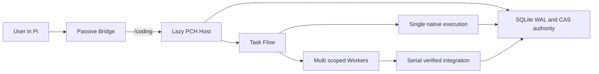

# Pi Coding Harness

Pi Coding Harness (PCH) 是一个显式启用的 Pi Coding Agent 外层执行框架。它把普通 Pi
会话转换为面向软件工程的、可恢复、可审计的执行环境，同时保留未启用时的原生 Pi 体验。

**Architecture:** [visual system overview](docs/ARCHITECTURE.md) ·
**Specification:** [normative implementation blueprint](docs/PI-CODING-HARNESS-BLUEPRINT.md) ·
**Usage:** [用户指南](docs/USER-GUIDE.md)

## 核心行为

- 只有用户运行 `/coding` 后才启动独立 Host、SQLite、CAS、上下文投影和工作流工具。
- `Single` 由当前 Pi Agent 直接执行，适合小型或强耦合工作。
- `Multi` 将可分解工作交给角色隔离的临时 Worker，并在受控镜像中产生 PatchSet；主 Host
  校验 preimage、scope、lease 和 oracle 后才集成到真实工作区。
- `Build` 使用最小 GoalContract 直接推进，不强制完整 PRD。
- `Plan` 生成并复审可执行路线，冻结后在 Pi UI 询问是否进入 Build、保留或修订。
- provider、model、thinking level 和 context window 始终继承用户当前 Pi 配置。
- Memory、Input Context、Compaction、Cache 和 Output 可独立关闭并有失败回退。

唯一权威设计是 [docs/PI-CODING-HARNESS-BLUEPRINT.md](docs/PI-CODING-HARNESS-BLUEPRINT.md)。
实施顺序见 [docs/IMPLEMENTATION-PLAYBOOK.md](docs/IMPLEMENTATION-PLAYBOOK.md)，用户命令见
[docs/USER-GUIDE.md](docs/USER-GUIDE.md)。

## 架构概览 / Architecture at a glance



Single 直接复用当前 Pi Agent 与真实工作区；Multi 只把 hash-bound TaskPacket 交给隔离 Worker，
Worker 输出经过 preimage、scope、lease、fencing token 和 fresh oracle 校验后才串行集成。
[完整英文架构说明](docs/ARCHITECTURE.md) 展示 Task Flow、模块拓扑、Single/Multi、持久权威、恢复路径、
安全模型和已验证性能证据。

| Release evidence | Result |
|---|---|
| Runtime | Node `24.18.0`, SQLite `3.53.1`, authority schema `19` |
| Aggregate | `489` passed, `6` conditional skips, `0` failures |
| Inactive path | `0` Host / SQLite / RPC / prompt / additional model-provider requests |
| Lifecycle | install, upgrade, uninstall, arbitrary-cwd and self-contained PASS |

## 环境

- Windows PowerShell 5.1 或 PowerShell 7
- Node.js `>=22.22.3 <23` 或 `>=24.15.0`，且内置 SQLite 必须包含 WAL-reset 修复
- npm `11.x`
- Pi Coding Agent `>=0.81.0 <=0.82.1`

## 本地开发

```powershell
npm ci
npm run compile
npm run lint
npm test
npm run build
npm run verify
```

## 安装

```powershell
# 先做无副作用预演
powershell -NoProfile -ExecutionPolicy Bypass -File scripts/install.ps1 -WhatIf

# 构建、迁移本地 authority，并向 Pi 注册本地 package
powershell -NoProfile -ExecutionPolicy Bypass -File scripts/install.ps1

# 只读诊断
powershell -NoProfile -ExecutionPolicy Bypass -File scripts/doctor.ps1
```

升级会先备份每个 authority database，再做 1 到 19 的 forward-only migration。默认卸载只移除
Pi package 注册并保留数据；`-DeleteData` 必须同时满足安装标记与显式 PowerShell 确认。

## 使用

```text
/coding
/coding single build 修复解析器的边界错误并运行测试
/coding multi plan 为模块化重构生成路线
/coding status
/coding pause
/coding resume
/coding replan 当前 API 假设已被证伪
/coding exit
```

未进入 PCH 时，扩展只注册命令和工具定义；不会启动 Host、打开 SQLite、注入 prompt、执行
provider hook RPC 或产生额外模型请求。

## 数据与隐私

默认数据根为 `~/.pi/agent/coding-harness`。SQLite WAL、不可变 event/receipt 和内容寻址 CAS
是持久权威；聊天、Widget 和 Markdown 只属于可重建投影。Worker 不复制 `.env`、凭据、
`.git`、依赖或构建输出，且不能联网。Memory Vault 的正文加密保存，索引只保存受限检索材料。

## 事实边界

- Cache 对已验证的 `geekspace/openai-completions` 运行时启用不修改 payload 的 `C1_PREFIX`；其他
  provider、API 或 base URL 自动回退 `C0`。正 `cacheRead` 可确认为命中，零值保持未知，不宣称固定命中率。
- Input Context 只治理 PCH 附加上下文和按需证据，不声称删除 Pi 原生聊天历史。
- Output 使用稳定短策略和本地 UI 去重，不通过额外 rewrite 模型请求缩短回复。
- 用户项目性能优化只有在有代表性 workload、正确性 oracle 和可逆候选时才进入试验。
