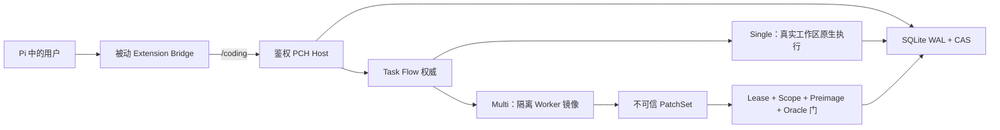

<div align="center">

# Pi Coding Harness

### 为 Pi Coding Agent 提供可靠、可恢复的工程执行层

面向持久任务状态、证据门控变更、可恢复工作流与隔离式 Multi-Agent 协作的显式启用框架。

[](https://github.com/KirschBluteX/pi-coding-harness/actions/workflows/ci.yml)
[](LICENSE)

[架构](docs/ARCHITECTURE.md) ·
[用户指南](docs/USER-GUIDE.md) ·
[实现蓝图](docs/PI-CODING-HARNESS-BLUEPRINT.md) ·
[English](README.md)

</div>

Pi Coding Harness（PCH）将用户显式启用的 Pi Coding Agent 会话转换为可审计的软件工程
执行环境。小任务保持直接执行，工作流权威持久化到 SQLite；并行 Worker 相互隔离，只有通过
scope、lease、preimage 与 fresh oracle 校验的变更才能进入真实工作区。

> **状态：Research Preview。** 本地正确性、生命周期、故障注入与集成表面已有大量自动化
> 测试。Provider-backed 压力对比和一条真实冷启动恢复路径仍明确排除在当前发布声明之外，
> 详见[证据边界](#证据边界)。

## 为什么需要 PCH

Coding Agent 擅长生成候选修改，但长周期工程任务还需要回答：谁拥有持久状态、哪些文件允许
修改、中断后如何恢复，以及什么证据足以授权集成。

PCH 建立五类明确边界：

- **持久权威**：SQLite WAL、不可变 event/receipt、版本化状态机、lease、fencing token 与 CAS。
- **安全 Multi-Agent 执行**：短生命周期 Worker 在受限镜像中工作，返回不可信 PatchSet，
  由 Host 串行验证。
- **可恢复工作流**：Goal、Route、WorkCell、Operation 与 Evidence 共同确定中断后的下一动作。
- **证据门控修改**：真实工作区变更必须满足 preimage、scope、当前 authority 与 fresh oracle。
- **未启用零开销**：执行 `/coding` 前不启动 Host、不打开 SQLite、不注入 prompt，且不增加
  provider 请求。

## 架构概览



Single 复用当前 Pi Agent 与真实工作区，适合小型或强耦合工作。Multi 只把显式分解的任务
降级为 hash-bound TaskPacket，并交给 `PLANNER`、`EXPLORER`、`IMPLEMENTER`、
`VERIFIER`、`INTEGRATOR` 等隔离角色。Worker 的文字叙述本身永远不构成 authority。

## 已实现的系统表面

| 表面 | 已实现内容 |
| --- | --- |
| 任务生命周期 | Intake、GoalContract、路线修订、阶段化 Plan、Operation prepare/observe/commit/reconcile、暂停/恢复/重规划与最终验收 |
| Authority | Forward-only SQLite schema、不可变事件链、CAS、lease、fencing、幂等与恢复投影 |
| Multi-Agent | 动态拓扑提案、受限镜像、有界执行、持久集成日志与 workload 可比性门 |
| Context | Input Context Compiler、保留证据、保护投影、Compaction receipt 与 provider-turn ledger |
| Memory | 加密 Vault、索引检索、冲突处理、纠正、过期、遗忘与删除 |
| 验证 | Unit、Integration、故障注入、生命周期、性能契约、源码闭包与 arbitrary-CWD 检查 |

## 快速开始

### 环境要求

- PowerShell 7（`pwsh`）
- Node.js `>=22.22.3 <23` 或 `>=24.15.0`
- npm `11.x`
- Pi Coding Agent `>=0.81.0 <=0.82.1`

Node.js 必须包含 SQLite WAL-reset 修复。PCH 会核验实际 runtime fingerprint，不仅依赖版本号。

### 从源码安装

```powershell
git clone https://github.com/KirschBluteX/pi-coding-harness.git
cd pi-coding-harness
npm ci

# 无副作用预演
pwsh -NoProfile -ExecutionPolicy Bypass -File scripts/install.ps1 -WhatIf

# 构建、安全迁移本地 authority，并注册 Pi 本地 package
pwsh -NoProfile -ExecutionPolicy Bypass -File scripts/install.ps1

# 只读诊断
pwsh -NoProfile -ExecutionPolicy Bypass -File scripts/doctor.ps1
```

## 使用

```text
/coding
/coding single build 修复解析器边界并运行测试
/coding multi plan 为模块化重构设计分阶段路线
/coding status
/coding pause
/coding resume
/coding replan 当前 API 假设已被证伪
/coding exit
```

Single 与 Multi 均支持 Plan/Build、澄清、路线纠错、恢复、Memory、Input Context、
Compaction、Output、cache telemetry 和性能门。Provider、model、thinking level 与 context
window 始终来自用户当前 Pi 配置。

## 本地开发

```powershell
npm ci
npm run compile
npm run lint
npm test
npm run build
npm run verify
```

完整验证还会检查 SQL/JSON/Markdown 契约、生命周期、arbitrary-CWD import、性能契约与
self-contained source closure。

## 证据边界

- 自动化正确性覆盖 unit、integration、fault、lifecycle、schema 与 source closure；
  每次发布验证后的精确数量记录在 `manifests/PROJECT-STATE.json`。
- 未启用路径验证 PCH Host 启动、SQLite 打开、RPC、prompt 注入与新增 model/provider 请求均为零。
- 只有 provider integration 给出可归因的正证据时 Cache 才从 `C0` 升级；零 cache-read 被视为
  unknown，而不是自动判为 miss。
- 生产 context window 下的自然 Compaction、provider-backed STRESS 与 Single/Multi 模型对比
  在实验真正执行前不会被宣称完成。

当前开发前沿见 [PROJECT-STATUS.md](PROJECT-STATUS.md)，完整证据模型见
[docs/ARCHITECTURE.md](docs/ARCHITECTURE.md)。

## 安全与隐私

运行数据默认位于 `~/.pi/agent/coding-harness`。Worker 镜像排除凭据、`.env`、Git 内部、
依赖、构建输出与运行状态；Worker 无权自行授权副作用，只有 Host 能集成验证通过的提案。
Memory 正文加密保存，telemetry 只记录有界 hash、计数与 reason code，不保存原始 provider payload。

安全问题请按 [SECURITY.md](SECURITY.md) 中的流程报告。

## 参与贡献

请先阅读 [CONTRIBUTING.md](CONTRIBUTING.md)、[Review Gates](docs/REVIEW-GATES.md) 与唯一规范性
[实现蓝图](docs/PI-CODING-HARNESS-BLUEPRINT.md)。

Pi Coding Harness 使用 Apache-2.0；Pi Coding Agent notices 保留原 MIT 条款，
详见 [THIRD_PARTY_NOTICES.md](THIRD_PARTY_NOTICES.md)。
