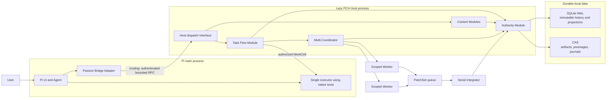
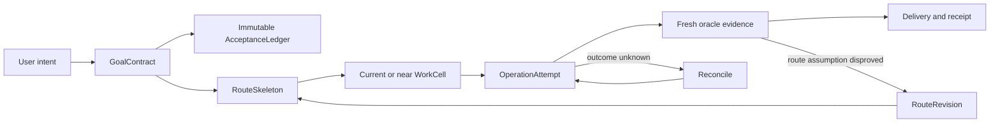
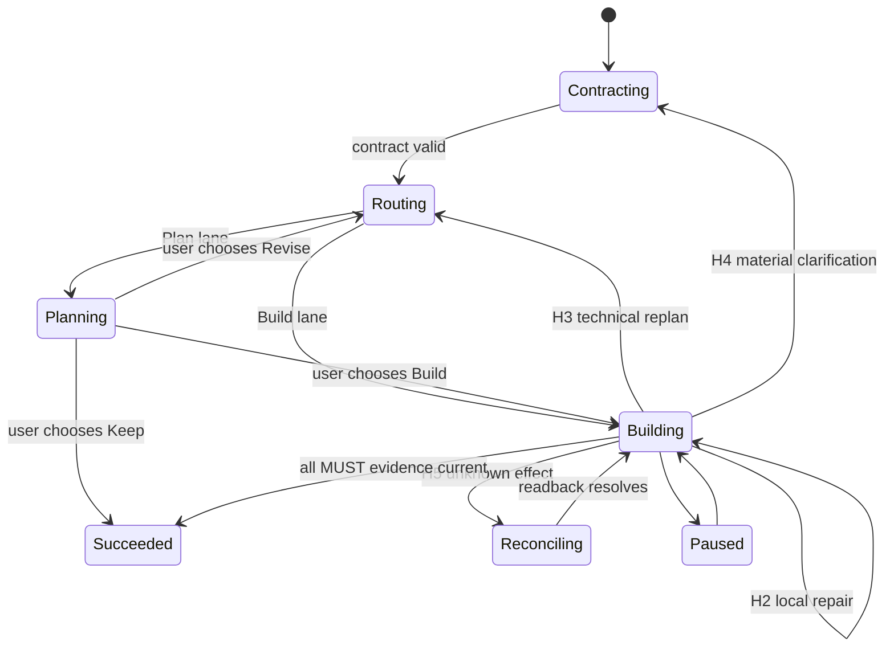
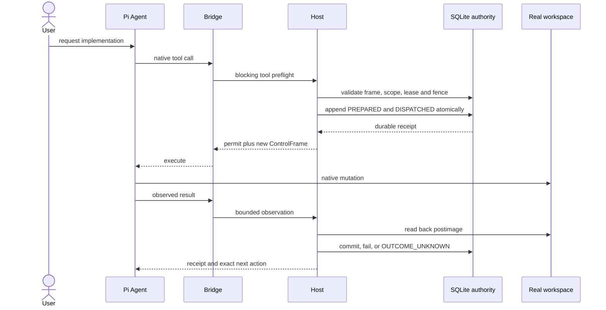
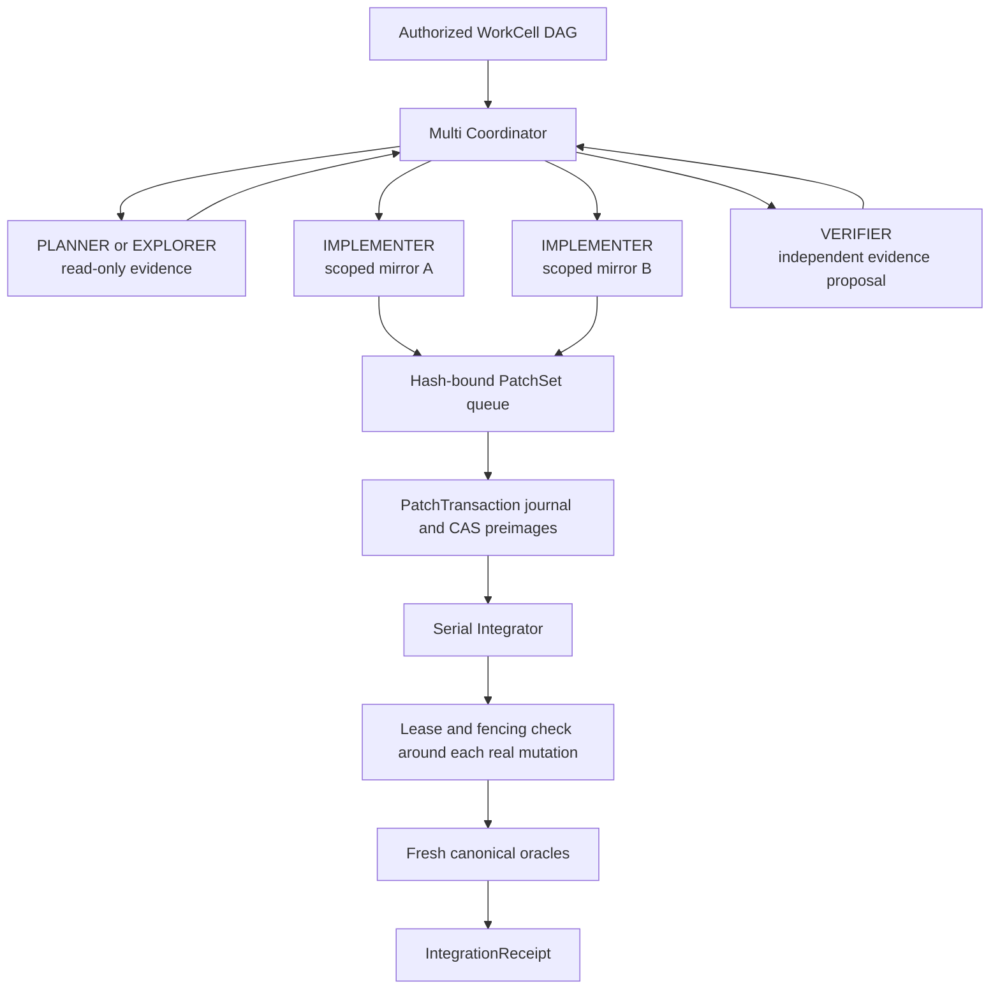

# Pi Coding Harness Architecture

> Reader-oriented architecture projection for reviewers and contributors. The
> [implementation blueprint](PI-CODING-HARNESS-BLUEPRINT.md) remains the single normative authority.

Pi Coding Harness (PCH) is an opt-in execution layer around Pi Coding Agent. It turns a normal Agent session into a
durable software-engineering workflow without replacing Pi's configured provider, model, thinking level, context
window, UI, or native tools.

## Architecture promises

| Promise | Architectural consequence |
|---|---|
| Explicit entry | Before `/coding`, PCH starts no Host, opens no SQLite database, injects no prompt, sends no RPC, and adds no model/provider request. |
| Durable authority | SQLite WAL, immutable events/receipts, leases, fencing tokens, and content-addressed storage decide what may mutate. |
| Small-task efficiency | A narrow change stays in a `DIRECT_CELL`; Single creates no Worker topology or integration ceremony. |
| Safe parallelism | Multi Workers operate in scoped mirrors. Their output is an untrusted proposal until serial integration passes fresh checks. |
| Recoverability | Restart reconstructs the exact next authorized action and reconciles unknown effects before allowing new mutation. |
| Honest optimization | Correctness and acceptance outrank speed. Provider-dependent savings are not claimed without provider evidence. |

## System architecture



The Bridge is passive until entry. After entry it remains a narrow Adapter: it owns command/tool registration, lazy
Host lifecycle, authenticated transport, and UI projection. Route decisions, SQL authority, Worker orchestration, and
integration stay behind the Host Interface.

### Process ownership

| Process | Owns | Must not own |
|---|---|---|
| Pi main process | User session, UI, configured model, native provider request and native tools | Durable PCH authority |
| Passive Bridge | `/coding`, Harness tool registration, Host lifecycle, compact hook transport | SQL, route authority, Worker integration |
| PCH Host | Task Flow, context additions, authority, recovery, Worker orchestration, local telemetry | Provider/model mutation not explicitly configured by the user |
| Worker session | One role and one hash-bound TaskPacket inside a scoped mirror | Canonical workspace, Supervisor chat history, private Memory, durable authority |

## Task Flow model

PCH keeps one durable hierarchy from user intent to evidence. Planning expands only the current and near horizon;
uncertain future work remains a typed deferred outcome.



The `GoalContract` freezes objective, lane, obligations, constraints, assumptions, non-goals, and user decisions. Each
MUST obligation needs a decidable local oracle. The `AcceptanceLedger` binds those obligations to source spans and
hashes so a chat summary cannot silently redefine completion.

The route is a validated DAG of WorkCells with dependencies, read/write roots, budgets, risks, assumptions, and
oracles. Four execution depths prevent planning overhead from becoming ceremonial:

| Lane | Intended use | Shape |
|---|---|---|
| `BYPASS` | Conversation or no project mutation | No managed Host run |
| `DIRECT_CELL` | One narrow, low-risk change | Minimal contract and one WorkCell |
| `ADAPTIVE_ROUTE` | Multi-file work or moderate uncertainty | One to three near WorkCells plus deferred outcomes |
| `FULL` | High-risk migrations or broad product behavior | Detailed but still rolling route |

### Route health and correction



Repeated failure signatures cannot retry forever. H3, H4, and H5 revoke the previous mutation authorization and
persist a new exact next action. Replanning transports only the changed horizon; unchanged typed route metadata is
reconstructed and validated locally.

## Single execution

Single lets the current Pi Agent work in the real workspace with native tools. It creates no WorkShard, TaskPacket,
WorkerRun, mirror, or PatchSet. Mutation still passes the same authority lifecycle.



Blocking preflight closes the gap between authorization and tool start. Each write binds its lease generation,
fencing token, input closure, idempotency key, result hash, and postimage. Read-only paths skip lifecycle RPC where no
authority transition is required, and a committed write avoids a redundant tool-end call.

## Multi execution

Multi is selected explicitly when independent work or role isolation is expected to justify startup, copy, and
integration cost. Roles are capabilities, not mandatory ceremony.

| Role | Canonical write access | Expected output |
|---|---:|---|
| `PLANNER` | No | Bounded route evidence |
| `EXPLORER` | No | Source or API findings with locations |
| `IMPLEMENTER` | No; mirror-only writes | PatchSet and concise summary |
| `VERIFIER` | No | Independent oracle-evidence proposal; never self-certifies a patch |
| `INTEGRATOR` | No; mirror-only writes | Conflict-resolution PatchSet when explicitly routed |



Each Worker receives one `TaskPacket`: Goal, Route and WorkCell hashes; one outcome; declared roots; oracle; budget;
dependency artifact hashes; failure signatures; expiry; and a capability HMAC. It does not receive full Supervisor
chat or private Memory.

Worker mirrors exclude `.git`, `.pi`, `.coding-harness`, dependencies, build/cache output, credentials, and non-template
`.env` files. Network, extensions, skills, prompt templates, context files, and persistent session history are disabled.
Parallel write roots must be mutually exclusive. Integration is always serial and checks the current canonical
preimage, lease, fencing token, postimage, and fresh canonical oracle before integration is accepted or
WorkCell/Goal acceptance advances.

## Durable authority and recovery

| Authoritative | Projection or untrusted input |
|---|---|
| Immutable SQLite events, receipts, revisions, Operations, Worker transitions and measurements | Chat text and model narrative |
| Current lease generation and fencing token | Widget and status Markdown |
| CAS bytes verified by `pch-cas://sha256/<hex>` | Worker summary and PatchSet before integration |
| Hash-bound IntegrationReceipt and fresh oracle evidence | Pi JSONL or tool text without an authority receipt |

SQLite uses WAL with `synchronous=FULL`. Schema migrations are forward-only and hash-checked; schema 19 includes core
authority, Memory, Input Context, Task Flow, Multi execution, Cache, Compaction, provider accounting, performance,
AcceptanceLedger, and PatchTransaction history.

Recovery follows a strict precedence:

```mermaid
flowchart LR
  S["Host start"] --> V["Verify SQL, foreign keys and integrity"]
  V --> L["Take or renew Goal lease"]
  L --> H["Rebuild projection heads"]
  H --> PT["Recover open PatchTransactions"]
  PT --> OP["Reconcile pending Operations"]
  OP --> W["Fence orphaned Workers"]
  W --> G["Restore Goal, Route and subject"]
  G --> C["Verify compaction frontier"]
  C --> N["Authorize exactly one next action"]
```



An unresolved side effect outranks new execution. A completed receipt is reused only while its declared input closure
still matches. Recovered OPEN clarifications are choice-first: no model/provider turn begins until the user resolves
the durable choice, then one productive continuation is sent.

## Context and efficiency Modules

| Module | Deep Interface | Cost control |
|---|---|---|
| Input Context | Demand, evidence, working set, compile receipt, projection delta | Search before exact reads; defer evidence until demanded; reuse valid receipts |
| Memory v3 | Capture, retrieve, correct, forget and purge | Local guarded capture; bounded working set; batched/debounced indexing |
| Compaction 2.1 | Prepare and verify an exact semantic capsule | Uses native compaction; no rewrite request |
| Cache v2 | Provider-specific request/settle accounting | Unsupported integrations stay at `C0`; no warmup or padding request |
| Output | Stable response contract and local UI projection | Tool phase is quiet; no additional rewrite request |
| Performance | Target-project optimization trials with frozen workloads, paired samples, correctness oracles and verdicts | Runs only for a requested or evidenced hotspot |

Planning, route review, Memory, Output, status, and replanning do not receive independent model requests. They reuse
the current Agent turn and deterministic local Modules. Provider accounting is ordered in the background and does not
block the provider request. Performance gains never waive correctness, privacy, acceptance, or durable authority.

## Source Module map

| Module | Main implementation |
|---|---|
| Bridge Adapter | [`src/bridge/register.ts`](../src/bridge/register.ts) |
| Host and authenticated protocol | [`src/harness/host`](../src/harness/host) |
| Task Flow and planning | [`src/task-flow`](../src/task-flow), [`src/planning`](../src/planning), [`src/runtime/task-flow-session.ts`](../src/runtime/task-flow-session.ts) |
| Authority, leases, repositories and migrations | [`src/authority`](../src/authority), [`schemas/sql`](../schemas/sql) |
| Operation and patch integration | [`src/effects`](../src/effects), [`src/task-flow/operation-lifecycle.ts`](../src/task-flow/operation-lifecycle.ts) |
| Multi domain and Worker execution | [`src/harness/domain.ts`](../src/harness/domain.ts), [`src/harness/repository.ts`](../src/harness/repository.ts), [`src/harness/worker`](../src/harness/worker) |
| Input Context | [`src/input-context`](../src/input-context) |
| Memory | [`src/memory`](../src/memory) |
| Compaction, Cache and Output | [`src/context`](../src/context), [`src/cache-v2`](../src/cache-v2), [`src/output`](../src/output) |
| Performance contracts and measurements | [`src/performance`](../src/performance) |

## Security model

- Bridge/Host newline-delimited JSON is authenticated with request IDs, nonces, and HMAC; replay, unknown fields,
  oversized payloads, and mismatched responses fail closed.
- Paths are canonical, workspace-contained, and checked against declared roots. Symlink/reparse traversal fails closed.
- Worker narrative and patches are scanned for secret-like material before persistence.
- Telemetry stores hashes, counts, and reason codes rather than raw provider prompts or credentials.
- Provider, model, thinking level, and context window come only from the active Pi configuration or an explicitly
  configured role profile; PCH does not silently downgrade them.
- Destructive uninstall requires an installation marker, an explicit delete flag, and confirmation.

## Release 1.2.1 evidence — 2026-07-28

The complete local aggregate recorded in
[`manifests/PROJECT-STATE.json`](../manifests/PROJECT-STATE.json) produced:

| Gate | Result |
|---|---|
| Runtime | Node `24.18.0`, SQLite `3.53.1`, authority schema `19` |
| Test aggregate | `489` passed, `6` conditional skips, `0` failures |
| Lifecycle | Install, upgrade, uninstall, arbitrary-cwd import, and self-contained checks passed |
| Separate installed-Pi probe | Pi Coding Agent `0.82.1`; inactive path, Host start, restart recovery, and cleanup passed; receipt hash recorded separately from the aggregate |
| Phase 1 local P95 | event commit `5.50 ms`; 1 MiB CAS put `24.07 ms`; snapshot read `3.50 ms`; lease renew `0.04 ms` |
| Additional requests from the release gate | model `0`; provider `0` |

Reproduce the aggregate gate from the repository root:

```powershell
powershell -NoProfile -ExecutionPolicy Bypass -File scripts/verify-project.ps1
```

This command does not run the separate installed-Pi probe. The numeric contracts and measurement rules are documented in
[`PERFORMANCE-BUDGET.md`](PERFORMANCE-BUDGET.md). Verification reports are intentionally excluded from Git; their
SHA-256 receipts, including the installed-Pi probe receipt, are preserved in project state.

### Evidence boundaries

- The provider exposed no monetary cost, so observed token/latency data is not converted into currency savings.
- No provider-backed comparative measurement currently proves token, output, quality, or end-to-end latency
  reduction.
- A positive provider `cacheRead` value proves a hit; zero or missing usage remains unobservable rather than a miss.
- Natural provider-driven compaction was not triggered in the recorded real run; deterministic compaction/recovery
  tests pass.
- WAL auto-checkpoint remains disabled. Any maintenance Module must first prove steady-state, concurrency, shutdown,
  and crash behavior off the user hot path.

## Further reading

- [Implementation blueprint](PI-CODING-HARNESS-BLUEPRINT.md) — normative behavior and acceptance matrix
- [Performance budget](PERFORMANCE-BUDGET.md) — numeric gates and honest measurement rules
- [User guide](USER-GUIDE.md) — commands, Single/Multi use, recovery, and lifecycle
- [SQL schema map](../schemas/sql/README.md) — migrations 001 through 019
- [Project state](../manifests/PROJECT-STATE.json) — hash-bound development receipts and evidence limits
