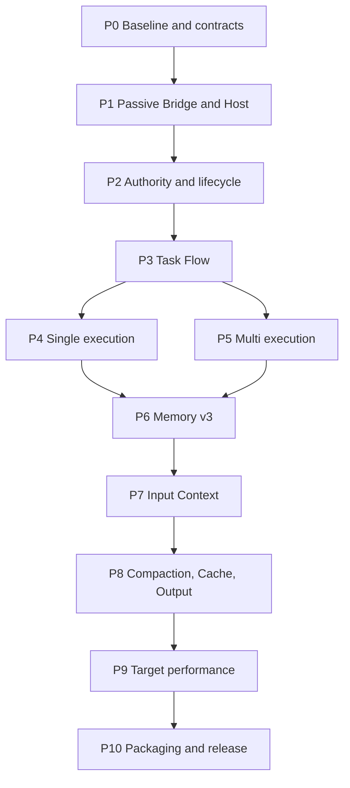

# Pi Coding Harness implementation playbook

This document operationalizes the authoritative blueprint. It does not redefine architecture. A later Agent should
use the smallest current slice, not replay completed phases whose input closure is unchanged.

## 1. Efficient execution protocol

1. Run `scripts/show-resume-context.ps1`.
2. Confirm `manifests/PROJECT-STATE.json` parses, authoritative hashes match and `next_action` is executable.
3. Read the named phase below, its touched source/tests, and only referenced blueprint sections.
4. Run the smallest test capable of disproving the intended change.
5. Modify one vertical slice through Interface, implementation and test.
6. Run focused test, compile and lint. Run full verify only at a phase/release exit.
7. On a major breakthrough, atomically update project state before another phase, pause or compaction.

Never rerun a valid performance epoch, dependency install, full test suite or architecture review solely because a
conversation compacted. Invalidate evidence only when source/config/runtime/fixture/oracle hashes in its closure change.

## 2. Phase graph and current completion



P0-P9 are implemented. P10 is complete only after the final clean-root verification and local Pi installation recorded
in `manifests/PROJECT-STATE.json`.

## 3. Phase contracts

### P0: Baseline and configuration authority

**Preconditions**: Node/npm/Pi versions discovered; no fixed model assumption.  
**Inputs**: `package.json`, installed Pi public types, user Pi runtime selection.  
**Files**: `src/config`, `config/default.json`, `src/index.ts`.  
**Interfaces**: strict config parser; provider/model/thinking/context are observed values.  
**Failure path**: unsupported Pi version or malformed config reports exact field; no Host state is created.  
**Tests**: config, runtime policy, compile against Pi public Interfaces.  
**Performance**: extension import performs no I/O beyond module load.  
**Exit**: no `setModel`, `setThinkingLevel`, hard-coded model/window/provider; config unknown keys rejected.

### P1: Passive Bridge and lazy Host

**Preconditions**: P0.  
**Inputs**: explicit `/coding` selection and Pi `ExtensionContext`.  
**Files**: `src/bridge/register.ts`, `src/harness/host/{client,protocol,server,runtime,entry}.ts`.  
**Interfaces**: `/coding`, four Harness tools, authenticated strict RPC.  
**Implementation**:

1. register definitions, remove Harness tools from active set;
2. no-op every hook while `active === null`;
3. on entry validate objective/runtime, spawn built Host and call `enter`;
4. activate only Harness tools while preserving other extensions' tool changes;
5. flush provider observation queue, shutdown Host and restore tools on exit/session shutdown.

**Failure path**: missing build/model/Host handshake leaves Bridge inactive and closes child.  
**Tests**: passive zero-call, lazy entry/exit, IPC HMAC/replay/unknown fields, unrelated cwd.  
**Performance**: no inactive filesystem/SQLite/RPC/provider request.  
**Exit**: PCH inactive behavior is observably native Pi.

### P2: Authority, CAS and forward migrations

**Preconditions**: local filesystem and writable marked data root.  
**Files**: `src/authority`, `src/artifacts`, `schemas/sql/001..019`, `src/runtime/lifecycle.ts`.  
**Interfaces**: idempotent command transaction, lease/fencing, CAS put/open, backup/migrate/restore.  
**Failure path**: hash mismatch, foreign key error, stale version or integrity failure rolls back/fails closed. Upgrade
restores verified backup; external side effects are not inferred from SQL commit.  
**Tests**: crash points, event chain, CAS tamper, lease fencing, projections, SQL validator, lifecycle matrix.  
**Performance**: WAL commits bounded; read-only status uses projections.  
**Exit**: migrations 1-19 and every repository integrity check pass.

### P3: Task Flow and route correction

**Preconditions**: P2.  
**Files**: `src/task-flow`, `src/planning`, `src/runtime/task-flow-session.ts`.  
**Interfaces**: GoalContract, RouteSkeleton, WorkCell, Authorization, Operation, EvidenceAttestation, RouteHealth,
DeliverableManifest.  
**Implementation**:

- Build submits minimal contract+route in one control call while preserving separate immutable records.
- Plan submits contract, same-turn reviewed route, then opens Build/Keep/Revise decision.
- managed admission persists the deterministic classification/profile/depth; PRD forces `ADAPTIVE_ROUTE`;
- exact bounded intake and AcceptanceLedger freeze atomically with GoalContract;
- explicit acceptance facets require the same bounded minimum of independent outcomes and MUST obligations;
- route qualification records the proposal/evidence/prior lane and applies promotion hysteresis;
- only current/near WorkCells are detailed; accepted distant work is deferred;
- meaningful receipts trigger deterministic health checks; H3/H4/H5 atomically revoke stale execution and enter
  RouteRevision, user decision or reconciliation;
- identical normalized failures observe `same_failure_retry_limit`.
- GenerationGovernor counts only authority/unique-evidence progress and refuses an unchanged stalled managed route.
- RouteRevision carries replacement current/near WorkCells plus changed metadata only; Host reconstructs unchanged
  metadata, reruns full finalization and rejects an unchanged effective execution projection.
- finalization binds all MUST oracles to one terminal WorkCell when the route has no deferred outcomes, without adding
  a model-visible validation-only stage; a mismatched non-terminal oracle still fails.

**Failure path**: incomplete facet/oracle/coverage/scope/DAG is rejected before authority mutation where possible;
changed draft may be corrected in the same normal turn.
**Tests**: admission, route classifier, PlanHealth, finalization, recovery and authority integration.  
**Performance**: no critic/planner request; DirectCell for narrow work; compact RouteRevision and local terminal
acceptance closure add no provider request.  
**Exit**: every MUST obligation has fresh decidable evidence and invalid routes cannot continue.

### P4: Single execution

**Preconditions**: authorized WorkCell and current goal lease.  
**Files**: `src/effects`, Single paths in `task-flow-session.ts`, Bridge tool hooks.  
**Interface**: prepare -> dispatch -> observe -> readback -> commit/reconcile.  
**Failure path**: path/scope rejection precedes tool; unknown outcome stops mutation; validation older than final write is
invalid; an explicit implementation Goal cannot close its final WorkCell with zero committed mutation unless a
user-confirmed revision freezes a `READ_ONLY` contract.
**Tests**: operation state machine, effect idempotency, readback/reconcile, validation ordering, Route-wide read versus
current-WorkCell write scope, timeout clamp, Single zero-shard direct execution.  
**Performance**: reads avoid lifecycle IPC; exact unique non-overlapping edit preimages may satisfy the fresh-source
gate locally; successful committed writes omit duplicate end call.  
**Exit**: real workspace change and fresh oracle close one DirectCell end to end.

### P5: Multi execution

**Preconditions**: user selected Multi; WorkCell route is safely decomposable.  
**Files**: `src/harness/domain.ts`, `repository.ts`, `worker/*`, Host Worker RPC, SQL 013.  
**Interfaces**: WorkShard DAG, TaskPacket, ShardLease, WorkerRun, WorkerResult, PatchSet, IntegrationReceipt.  
**Implementation**:

1. define 1-32 role shards with bounded roots and oracle;
2. validate DAG, dependencies and conflicting parallel roots;
3. resolve role runtime from user Pi configuration, recording fallback;
4. create scoped mirror and in-memory no-extension Worker session;
5. run ready shards up to configured cap;
6. persist bounded result/patch in CAS;
7. prepare a CAS-backed PatchTransaction journal and preimages before canonical apply;
8. integrate serially through normal operation gate and bind the receipt to the journal;
9. run canonical WorkCell oracle after integration.

**Failure path**: timeout/abort/failure creates terminal transition and RouteHealth; expired/stale Worker is fenced;
conflict never overwrites canonical bytes; uncertain compensation enters reconciliation.  
**Tests**: sandbox path and secret rejection, Worker lifecycle/recovery/fencing, parallelism, preimage conflict,
PatchTransaction crash compensation/unknown outcome and integration.  
**Performance**: no ceremonial roles; roots/copy caps; up to eight Workers; concise output.  
**Exit**: concurrent independent Workers cannot corrupt each other or canonical workspace.

### P6: Memory v3

**Preconditions**: Vault/data root available; Memory independently enabled.  
**Files**: `src/memory`, authority memory repositories, SQL 008-010.  
**Interfaces**: manual remember/recall/correct/forget/purge; guarded capture; bounded working set; visibility binding.  
**Failure path**: Vault/index/capture error falls back to empty projection/manual capture; secret or ambiguous capture is
rejected; purge cannot resurrect content.  
**Tests**: deterministic capture cases, privacy, tamper, lifecycle, request ledger, retrieval conflict and Multi
visibility.  
**Performance**: no model request; structured scan/result/token caps; index outbox is batched/debounced.  
**Exit**: configured `EXPERIMENTAL` recall and `GUARDED_AUTO` capture work while manual controls remain.

### P7: Input Context and provider ledger

**Preconditions**: P3 and P6 Interfaces stable.  
**Files**: `src/input-context`, `src/harness/host/context-runtime.ts`, SQL 012/016.  
**Interfaces**: candidate, demand, working set, compile receipt, layout, sequence-root projection delta, `coding_context`, provider ledger.  
**Failure path**: budget/scope/staleness/cursor/projection uncertainty falls back to Pi baseline; protected authority is
never silently dropped.  
**Tests**: compiler, structural representation, projector append-only/idempotency/full reconcile, context tool cursor,
provider ledger, `message_end`/`turn_end` fallback idempotency, Bridge content non-transport and Host negative inputs.  
**Performance**: compact descriptor spine over IPC; exact bytes only from CAS on demand; provider telemetry is ordered
in the background and adds no provider request.  
**Exit**: normal turn gets bounded additions, deferred evidence is retrievable, raw prompt content is absent from ledger.

### P8: Compaction 2.1, Cache v2 and Output

**Preconditions**: exact execution subject and provider-turn ledger.  
**Files**: `src/context/compaction-v21`, `src/cache-v2`, `src/harness/output-policy.ts`, `src/output`, SQL 014-016.  
**Interfaces**: compaction capsule transitions; Cache request/settle; stable output policy/response accounting.  
**Failure path**: compaction mismatch -> recovery required; provider/API/base-URL mismatch -> effective C0; normalized
zero Cache usage -> UNOBSERVABLE; output policy never truncates required result or creates rewrite request.  
**Tests**: compaction restart/frontier, Cache C1 positive usage/zero ambiguity/runtime fallback/partition/lineage,
output mandatory slots and provider attribution.  
**Performance**: native compaction only; stable short output directive; noncritical telemetry not synchronous.  
**Exit**: exact recovery works; verified runtime gets non-mutating C1, other runtimes get C0; Cache claims remain honest;
routine progress is quiet.

### P9: Target-project performance

**Preconditions**: explicit/evidence-based hotspot and representative workload.  
**Files**: `src/performance`, SQL 017, performance tests.  
**Interfaces**: PerformanceContract, measurement, verdict, route phase.  
**Failure path**: correctness/noise/impact ceiling/holdout failure rejects candidate and restores baseline.  
**Tests**: measurements, Task Flow integration, candidate-blind paired verdict, local P50/P95 suite.  
**Performance**: baseline guard adds no profiling to ordinary small task.  
**Exit**: optimization claim includes workload, samples, effect and rollback evidence.

### P10: Packaging and release

**Preconditions**: P0-P9 and clean target directory.  
**Files**: README/AGENTS/docs, manifests, scripts, package lock, license.  
**Steps**:

1. construct dependency closure excluding node_modules, dist, reports, runtime state and secrets;
2. generate migration manifest and source hashes;
3. run clean `npm ci`, compile, lint, build, full tests, SQL/JSON/Markdown;
4. run lifecycle, self-contained, arbitrary-cwd, inactive zero-cost and performance gates;
5. install local package and run doctor from unrelated cwd;
6. update project state with hashes/results;
7. initialize local Git and initial commit if identity exists; never remote/push.

**Failure path**: do not claim release; repair only invalidated slice and rerun triggered gates.  
**Exit**: every acceptance in the blueprint maps to a current PASS and the final root has no external runtime dependency.

## 4. Review triggers

Use `docs/REVIEW-GATES.md`. Reviews are triggered by a real change surface, not repeated ceremony. Schema,
authority, effects, sandbox, context projection and provider mutation are always high-risk. Documentation-only wording
does not rerun performance unless a parsed budget or command changed.

## 5. Completion record format

For each completed phase, `manifests/PROJECT-STATE.json` records:

```json
{
  "phase": "P10",
  "status": "PASS",
  "input_sha256": "<64 hex>",
  "evidence": [{ "command": "npm run verify", "result": "PASS", "sha256": "<64 hex>" }],
  "next_action": "NONE"
}
```

Do not manufacture a PASS from document presence, test count alone, historical reports or a different project root.
