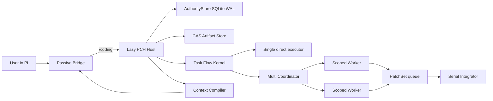
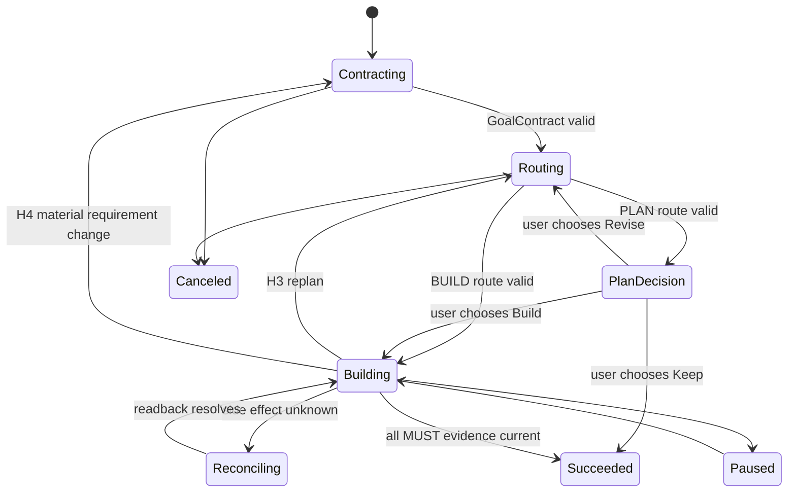

# Pi Coding Harness implementation blueprint

Status: authoritative implementation specification  
Version: 1.2.1  
Authority schema: 19  
Updated: 2026-07-27

This is the only architecture authority for Pi Coding Harness (PCH). Supporting documents may explain
implementation order, user operation, budgets, or gates, but cannot change a contract in this file.

## 1. Product definition

PCH is an opt-in harness outside Pi Coding Agent. It turns one user-selected coding task into a durable,
evidence-driven software-engineering run. Pi remains the interactive shell and model client; PCH owns task
authority, execution admission, context additions, recovery, optional Worker isolation, and verification closure.

PCH is not an autonomous chat replacement, a provider proxy, a server-side cache, or a claim that the model sees
less native Pi history. Its leverage comes from selecting small additional context, keeping exact local state, and
using short-lived role-isolated Worker sessions when decomposition has positive expected value.

### 1.1 Required outcomes

| ID | Outcome | Acceptance |
|---|---|---|
| PCH-G-001 | Native Pi outside Harness | Before `/coding`, Host starts=0, SQLite opens=0, RPC=0, prompt additions=0, extra model/provider requests=0. |
| PCH-G-002 | Fast reliable Single | A narrow Build can use one GoalContract, one DirectCell, one fresh oracle, and one delivery closure. |
| PCH-G-003 | Useful Multi | Independent shards may run concurrently in scoped mirrors; canonical writes integrate serially with preimage and oracle checks. |
| PCH-G-004 | Plan that can continue | Plan is reviewed in the current turn, frozen, and followed by an explicit Build/Keep/Revise choice. |
| PCH-G-005 | Evidence-driven correction | A disproved assumption or repeated failure changes the route instead of repeating stale work. |
| PCH-G-006 | Exact recovery | Goal, route, current subject, pending effects, Worker frontier and next action survive restart and compaction. |
| PCH-G-007 | Bounded context cost | PCH additions are deterministic, budgeted, stable-prefix aware and retrievable on demand. |
| PCH-G-008 | Honest optimization | No cache, token, latency or target-performance benefit is claimed without attributable evidence. |
| PCH-G-009 | Bounded autonomous progress | Repeated turns without authority or unique-evidence progress are detected locally and an unchanged managed route is refused. |

### 1.2 Non-goals

- Changing the user's provider, model, thinking level, context window or credentials.
- Running a hidden planning, critic, summarizer, memory, review, or rewrite model request.
- Letting Worker narrative, chat, Markdown, Widget or Pi JSONL authorize a side effect.
- Guaranteeing a cache hit rate, exact ETA, exactly-once external delivery, or universal performance improvement.
- Copying secrets, dependency directories, build output, Git internals or unrestricted workspaces into Workers.

## 2. Final design audit

The current implementation and every active capability were rechecked against correctness, user wait, context
growth, failure recovery, privacy, configuration authority and testability. The following decisions supersede all
earlier drafts.

| ID | Finding | Decision | Implementation evidence |
|---|---|---|---|
| PCH-AUD-001 | An always-loaded in-process runtime would tax ordinary Pi use. | Replace with passive Bridge plus lazy authenticated Host. | `src/bridge/register.ts`, `src/harness/host/client.ts` |
| PCH-AUD-002 | A full PRD for every Build creates avoidable model/tool work. | Build uses the smallest complete GoalContract and 1-3 near WorkCells. | `src/task-flow/admission.ts`, `src/runtime/task-flow-session.ts` |
| PCH-AUD-003 | Plan without a continuation action strands useful work. | Freeze, show Build/Keep/Revise in Pi UI, persist explicit choice. | Bridge `continuePlan`; Task Flow continuation tests |
| PCH-AUD-004 | A second critic request raises latency and can disagree with the first plan. | Review route within the same normal Agent turn; deterministic validators decide authority. | workflow prompt plus `submit_route` validator |
| PCH-AUD-005 | Unbounded automatic retry wastes time and tokens. | Normalize failure signatures; retry limit 0-3; then repair, replan, ask or reconcile. | `plan-health.ts`, Worker failure path |
| PCH-AUD-006 | Direct concurrent writes can corrupt the workspace. | Workers write only mirrors; PatchSets integrate serially after preimage checks. | `worker/executor.ts`, `integrateHarnessPatch` |
| PCH-AUD-007 | Worker context can leak Supervisor-private memory. | Only explicitly bound `VERIFIED_SHARED` claims enter TaskPacket. | memory visibility binding tables and tests |
| PCH-AUD-008 | Copying an entire repository into each Worker is expensive. | Copy declared minimal roots, ignore heavy/sensitive trees, enforce file/byte caps. | scoped mirror implementation |
| PCH-AUD-009 | Synchronous telemetry delays provider calls. | Provider begin/settle use an ordered background observation queue and flush at boundaries. | Bridge provider hooks |
| PCH-AUD-010 | Repeated full tool results inflate IPC/context. | Hash and bound IPC payload; preserve full evidence in CAS; rehydrate only when live. | `boundedResult`, Input Context capture/tool |
| PCH-AUD-011 | Automatic memory based on arbitrary text risks false durable claims. | Guarded deterministic capture accepts explicit durable directives or verified decisions; manual path remains. | Memory v3.1 capture and Vault tests |
| PCH-AUD-012 | Physical deletion conflicts with immutable audit history. | Forget hides reversibly; purge cryptographically destroys current Vault material and records proof, retaining non-content audit. | Memory purge intents/receipts |
| PCH-AUD-013 | Prefix metrics without provider usage evidence are misleading. | Activate provider-specific C1 only for a hash-bound, pre-activation usage window; positive reads are HIT and normalized zero remains UNOBSERVABLE. | Cache v2 runtime/repository and provider evidence manifest |
| PCH-AUD-014 | A universal Cache Adapter before two providers is speculative. | Keep provider-specific integration; extract a neutral seam only after two contract-equivalent adapters. | config validation and C0 fallback |
| PCH-AUD-015 | Smaller context can increase misses or compaction churn. | Runtime-derived budgets; append-only generation; native compaction only at safe frontier. | Input Context budget and Compaction 2.1 |
| PCH-AUD-016 | Output hiding alone does not reduce generated tokens. | Stable short instruction, tool-time silence, Widget dedupe and complete accounting; no rewrite request. | output policy and provider-turn ledger |
| PCH-AUD-017 | Generic profiling of every project slows small tasks. | Baseline guard by default; profile only with evidence or explicit request and a bounded workload contract. | target performance Module |
| PCH-AUD-018 | Mutable status files can become a competing ledger. | Product state remains SQLite/CAS; project status is a checked development projection only. | lifecycle and state scripts |
| PCH-AUD-019 | Broad legacy documents and commands cause route drift. | Delete them; one blueprint, five supporting documents, compact manifests. | release tree validation |
| PCH-AUD-020 | Fixed Pi version assumptions age poorly. | Probe current installed package; constrain only the tested peer range and fail clearly outside it. | package peer range and lifecycle doctor |
| PCH-AUD-021 | A frozen contract can omit or distort a user acceptance facet while remaining structurally valid. | Persist exact bounded intake and an immutable AcceptanceLedger in the same authority transaction as the GoalContract. | SQL 018, `acceptance-ledger.ts`, authority fault tests |
| PCH-AUD-022 | One-shot lane classification either over-plans small work or oscillates after new evidence. | Qualify the proposed route against current evidence, permit one initial correction, and use hysteresis for later promotion. | route finalization v2 tests |
| PCH-AUD-023 | Recording H3 without changing authorization lets an invalid route continue. | H3 atomically revokes execution, invalidates affected evidence and opens RouteRevision; H4/H5 similarly enter their required state. | Task Flow repository and recovery tests |
| PCH-AUD-024 | Multi-file integration can crash after a partial canonical apply. | Prepare a hash-bound PatchTransaction journal with CAS preimages before apply; compensate or enter H5 without blind retry. | SQL 019 and PatchTransaction fault tests |
| PCH-AUD-025 | Reprojecting the full Pi message history on every context hook adds hashing and IPC work. | Exchange append deltas bound by lineage/count/sequence root; mismatch forces one bounded full reconcile. | projection delta and Bridge/Host tests |
| PCH-AUD-026 | Provider turns and prose can masquerade as progress and sustain expensive loops. | GenerationGovernor counts only authority/evidence delta, nudges after two unchanged turns, and refuses a previously stalled identical managed route. | Governor unit/Host/Bridge tests |
| PCH-AUD-027 | A fake Single `SUPERVISOR` shard adds transactions without isolation or scheduling leverage. | Single Pi Agent executes the authorized WorkCell directly; WorkShard/TaskPacket/WorkerRun exist only in Multi. | Harness authority and Task Flow tests |
| PCH-AUD-028 | Returning both a transition message and the complete status line repeats model-visible text. | Put full state in the deduplicated Widget and return only the business message plus missing `next/health/blocker` deltas. | Bridge output regression test |
| PCH-AUD-029 | A ControlFrame captured only at Agent-run start becomes stale after a same-turn Contract, Route or Operation transition. | Every authority-changing Host result returns a compact fresh frame receipt; Bridge installs it before another managed action. | same-turn flow and managed lifecycle Bridge tests |
| PCH-AUD-030 | Vague optional Route fields make the model guess enums and allow unknown fields to be silently discarded. | Publish the exact compact proposal shape, omit empty optional arrays, and reject every unknown root or nested proposal field before persistence. | workflow prompt and finalization tests |
| PCH-AUD-031 | Repeating the complete Route on every correction amplifies output/input and can persist a semantically unchanged revision. | RouteRevision accepts replacement current/near WorkCells plus changed metadata; Host reconstructs prior metadata, reruns full finalization, then rejects unchanged effective execution semantics. | `route-revision.ts` and Task Flow regressions |
| PCH-AUD-032 | Pi recovery may expose a complete assistant message at `turn_end` without an extension-visible `message_end`, losing provider usage. | Settle from either hook through one idempotent in-memory turn owner; a second signal is a no-op and unresolved turns remain honestly unknown. | Bridge provider accounting tests |
| PCH-AUD-033 | A model timeout above the local oracle ceiling creates a predictable rejection/retry turn. | Normalize a finite tool timeout to 1-900 seconds before applying the frozen oracle policy; do not widen the authority ceiling. | Task Flow timeout-clamp regression |
| PCH-AUD-034 | Restricting reads to only the current WorkCell prevents efficient inspection of already frozen near-horizon files. | Single Supervisor may read all frozen Route read/write roots; mutation remains restricted to the authorized WorkCell write roots. | Task Flow Route-scope regression |
| PCH-AUD-035 | Requiring a separate fresh read before every exact edit adds model turns even when the edit carries a decisive preimage. | A bounded unique, non-empty, non-overlapping exact `oldText` set may prove current source locally; all ambiguous, broad or changed inputs keep the fresh-read gate. | Input Context evidence regression |

No known higher-order correctness or safety issue remains in the implemented scope. External effectiveness remains
conditional where provider behavior or real workloads are required; those limits are not implementation PASSes.

## 3. System architecture



### 3.1 Process ownership

| Process | Owns | Must not own |
|---|---|---|
| Pi main process | UI, user session, current configured model, native provider request | durable PCH authority |
| Passive Bridge | command/tool registration, lazy Host lifecycle, compact hook transport | SQL, route decisions, Worker integration |
| PCH Host | authority, route, context additions, Worker orchestration, local telemetry | user credentials or provider mutation without integration |
| Worker session | one role and TaskPacket inside scoped mirror | canonical workspace, Supervisor history, durable authority |

The Bridge and Host communicate with newline-delimited authenticated JSON. Every request/response has a request ID,
nonce and HMAC. Replay, unknown fields, oversized data and mismatched responses fail closed. The 32-byte Host secret
is passed by environment once, deleted immediately in the child, and zeroed on shutdown.

### 3.2 Module map

| Module | Deep Interface | Main implementation |
|---|---|---|
| Bridge | `registerCodingHarness(pi)` | `src/bridge/register.ts` |
| Host | `dispatch(method, params)` | `src/harness/host/runtime.ts` |
| Task Flow | GoalContract -> RouteSkeleton -> WorkCell -> Operation -> Evidence -> Delivery | `src/task-flow`, `src/runtime/task-flow-session.ts` |
| Harness authority | Run, topology, shard, packet, Worker, PatchSet, integration | `src/harness/domain.ts`, `repository.ts` |
| Worker executor | `runReady()` | `src/harness/worker/executor.ts` |
| Context compiler/actuator | `prepare/project/context` | `src/input-context`, `host/context-runtime.ts` |
| Memory | capture/retrieve/correct/forget/purge | `src/memory`, authority repositories |
| Compaction | prepare/verify exact semantic capsule | `src/context/compaction-v21` |
| Cache | provider-specific observe/mutate arm with C0 fallback | `src/cache-v2` |
| Performance | frozen workloads, paired measurements, verdict | `src/performance` |

## 4. Entry, intent and topology

### 4.1 Zero-cost inactive state

At extension load, register `/coding`, `/memory` and four PCH tool definitions, then remove PCH tools from the active
tool list. Every event handler begins with an in-memory `active` check. It performs no filesystem/config/Host work
until explicit entry. `session_start` resets only the active tool list.

### 4.2 Entry grammar

```text
/coding [single|multi] [plan|build] <objective>
```

Missing values are asked in Pi UI. Recommendations are Single and Build because they have the lowest overhead for
the common tightly coupled coding task. Noninteractive entry must supply all three values.

`Intent` and `Topology` are orthogonal:

| | Single | Multi |
|---|---|---|
| Build | Current Pi Agent implements the authorized WorkCell directly | Coordinator defines/runs only useful shards, then verifies canonical workspace |
| Plan | Current Pi Agent writes reviewed route, then asks continuation | Role-isolated planning/exploration may contribute; no canonical mutation before Build |

No old name or alias is accepted. Ordinary natural language never silently enters Harness.

## 5. Goal and route workflow



### 5.1 GoalContract

A contract contains objective, intent, lane, obligations, constraints, assumptions, non-goals, user decisions and
optional target-performance contract. Each MUST obligation has a decidable local oracle. Build admits the smallest
complete contract; Plan may include user, outcome, scope, failure path and product detail when the request actually
requires a PRD. Admission persists the deterministic classification, requirement profile and planning depth in the
same authority transaction. Explicit `must` clauses and semicolon-delimited measurable outcomes establish a bounded
minimum of 1-6 independent user outcomes and MUST obligations; generic placeholders never satisfy semantic validation.
Task text is printable NFC and at most 32,768 characters; larger specifications must be referenced as project files.

The exact bounded intake is persisted before planning. GoalContract freeze atomically creates an immutable
AcceptanceLedger containing source spans/hashes, inferred outcomes, negative constraints, non-goals and links to every
MUST obligation. Any uncovered MUST or unresolved material ambiguity rejects freeze; chat summaries cannot replace it.

### 5.2 RouteSkeleton

The route contains typed assumptions, risks, alternatives, WorkCells, dependencies, budgets, read/write roots,
oracles and deferred outcomes. It expands only current and near work. Validity rules:

1. graph is acyclic and every dependency exists;
2. every MUST obligation maps to at least one WorkCell and oracle;
3. write roots are workspace-relative and bounded;
4. no effect occurs before authorization;
5. future uncertain work is a typed deferred outcome, not invented detail;
6. same-turn route review checks omission, unsafe assumptions, unnecessary WorkCells, cheaper valid alternatives,
   rollback and waiting cost before one submission.
7. proposals contain only the documented root and nested fields; unknown fields fail with the exact path instead of
   being silently ignored. Optional typed arrays are omitted when they add no decision value.
8. when no deferred outcome remains, local finalization projects every MUST oracle onto one terminal WorkCell and
   binds it after the other terminal cells, avoiding a model-visible validation-only stage;
9. a RouteRevision transports only 1-3 replacement current/near WorkCells and changed metadata. The Host reconstructs
   unchanged typed metadata from the frozen Route and reruns the same scope, DAG, oracle and acceptance validators;
10. RouteRevision no-op detection compares the fully finalized logical execution projection, not raw model bytes, so
    omitting locally generated closure fields cannot manufacture a new revision.

### 5.3 Specification classes and execution lanes

| Class or lane | Use | Planning overhead |
|---|---|---|
| BYPASS | conversation/no project mutation | no Host run should have been entered |
| DIRECT_CELL | one narrow low-risk change | minimal contract plus one WorkCell |
| ADAPTIVE_ROUTE | multi-file/moderate uncertainty | 1-3 near WorkCells plus deferred outcomes |
| FULL | high risk, migration, broad product behavior | detailed contract and route, still rolling |

The local classifier is authority-bound for managed admission and adds no model request. User profile/depth overrides
win. PRD always enters `ADAPTIVE_ROUTE`; deterministic route qualification may lower later execution overhead but may
not remove an acceptance or safety obligation.

Route qualification compares the intake hint, proposed lane and current evidence. It may reclassify the first route
once. After execution starts, `ADAPTIVE_ROUTE` is held unless new evidence justifies promotion; it does not oscillate
back to DirectCell. Every decision persists proposal, evidence candidate, prior lane and hysteresis action.

### 5.4 Route health and correction

After a meaningful tool result and at WorkCell exit, local code checks:

`bounded work -> receipt -> PlanHealth -> Continue | Retry | Local Repair | Replan | Ask User | Reconcile`.

| Level | Meaning | Action |
|---|---|---|
| H0 | healthy | continue |
| H1 | transient, bounded | retry within configured limit |
| H2 | local reversible defect | repair current WorkCell |
| H3 | technical route invalid | invalidate dependent current view and open RouteRevision |
| H4 | behavior/scope/acceptance/preference uncertain | ask one bounded recommended choice, then GoalContract revision |
| H5 | unknown side effect or state conflict | stop mutation and reconcile; fail only when no correction route exists |

New evidence invalidates affected receipts/artifacts in the current projection but never deletes history. Identical
failure signatures cannot retry indefinitely. Route choice is lexicographic: hard constraints/security, acceptance
reachability, evidence strength, quality/risk/reversibility, then requests/tokens/latency/interrupt cost.

H3/H4/H5 are state transitions, not advisory labels. H3 atomically revokes current authorization, invalidates affected
evidence and changes `next` to `SUBMIT_ROUTE`; H4 revokes mutation and changes `next` to `RESOLVE_DECISION`; H5 stops
mutation and changes `next` to `RECONCILE_OPERATION`. Recovery reconstructs the same next action.

At H3 the Agent submits `submit_route_revision`, not another complete Route. Valid prior metadata and completed
workspace changes are preserved locally; only the changed horizon and changed typed metadata cross the model/Host
Interface. An effectively identical route is rejected before authority mutation.

GenerationGovernor is a non-authoritative in-process guard around this loop. A provider request or assistant prose is
not progress. A changed ControlFrame or new hash-distinct tool evidence is progress. The first unchanged turn is
tolerated, the second receives one stable ephemeral nudge, and later attempts to repeat an already stalled identical
managed route are rejected. New user input, progress, waiting-user and terminal states reset the guard. It adds no
model request, does not truncate output, and cannot claim to cancel provider reasoning; Host restart safely resets it.

## 6. Single execution

Single creates no WorkShard, TaskPacket or WorkerRun. The current Pi Agent executes the authorized WorkCell with native
tools in the real workspace; Task Flow Operations provide all required accounting. For mutations:

1. normalize target and reject path escape or undeclared write root;
2. capture workspace baseline and create immutable OperationAttempt;
3. bind lease generation, fencing token, input closure and idempotency key;
4. mark dispatched immediately before tool start;
5. hash bounded tool result and read back the postimage;
6. commit, fail, or mark `OUTCOME_UNKNOWN`;
7. after final write run each declared oracle once;
8. map fresh PASS Operations to obligations and close WorkCell/Goal;
9. when an explicit implementation Goal reaches its final WorkCell, reject closure unless the Goal contains a
   committed mutation; a user-confirmed no-change result requires a revised `READ_ONLY` GoalContract.

During BUILD, built-in reads may inspect any path already declared by any current/near WorkCell in the frozen Route.
Writes remain current-WorkCell scoped. A finite model-supplied validation timeout is clamped to the authoritative
1-900 second range before oracle evaluation, avoiding a rejection-only retry without extending execution authority.

Input Context keeps the fresh-source gate for existing mutation targets. For exact edit tools only, local code may
replace a separate read receipt with an optimistic preimage proof when every non-empty `oldText` occurs exactly once,
the edits do not overlap, the file is a non-link regular file at most 8 MiB, and edit arguments total at most 1 MiB.
Every other case requires the normal current exact-source receipt.

The ControlFrame fences each managed action, not an entire Agent run. Blocking tool preflight atomically persists the
OperationAttempt plus `PREPARED` and `DISPATCHED` transitions in one authority transaction immediately before Pi may
execute the tool; it does not depend on Pi's earlier `tool_execution_start` notification. Every successful
Contract/Route/control, Operation preflight, observation or recovery response carries the new frame hash. Bridge
installs that receipt synchronously before Pi may issue another managed action in the same turn. Stale model actions
remain fail-closed; a local status read refreshes the frame without requiring another provider request.

Read-only tools skip lifecycle IPC where no authority transition is needed. A successful committed write omits a
redundant tool-end call. This keeps the correctness gate while avoiding the former multi-call ceremony.

## 7. Multi execution

### 7.1 Admission

Multi is user-selected at entry. It is useful when at least two tasks can run independently or role isolation lowers
context interference enough to justify startup/copy cost. One IMPLEMENTER shard is valid; extra roles are not a
ceremonial requirement. If decomposition has no expected wall-time or quality benefit, use Single.

### 7.2 Roles

| Role | Write access | Expected output |
|---|---:|---|
| PLANNER | no | bounded route evidence |
| EXPLORER | no | source/API findings with locations |
| IMPLEMENTER | declared roots | PatchSet plus concise summary |
| VERIFIER | no | oracle evidence; never self-certifies a patch |
| INTEGRATOR | declared roots | conflict resolution PatchSet when explicitly routed |

Each role receives a `TaskPacket`: goal/route/WorkCell hashes, one outcome, roots, oracle, budget, dependency artifact
hashes, failure signatures, expiry and capability HMAC. It receives neither full Supervisor chat nor private memory.

### 7.3 Runtime selection

Default is exact Supervisor provider/model/thinking/context. A role profile may reference a model already configured
in Pi. The Host verifies model existence and auth; unavailable profiles fall back to Supervisor and record a reason.
No profile can mutate the user's active Pi setting.

### 7.4 Scoped mirror and tools

- Copy only declared read/write roots into a fresh OS temp directory.
- Reject symlinks/reparse traversal; ignore `.git`, `.pi`, `.coding-harness`, `node_modules`, build/cache output,
  credentials and non-template `.env` files.
- Default hard cap: 8,192 files and 128 MiB per Worker mirror.
- Expose only local read/ls/grep/find and, for IMPLEMENTER/INTEGRATOR, edit/write.
- Network, extensions, skills, prompt templates, context files and persistent session history are disabled.
- Worker narrative is capped and scanned for secret-like values before CAS persistence.

### 7.5 Parallelism and integration

The shard graph validator rejects cycles, scope conflicts and unmet dependencies. The Host starts up to the lower of
configured, requested and eight ready Workers. Worker sessions run concurrently; the Integration Interface uses a
single promise tail. Before touching canonical files, it stores a bounded PatchTransaction journal and every available
preimage in CAS, then commits the journal binding and `INTEGRATING` state in one authority transaction. For each patch
entry it checks current preimage, writes through the normal Operation gate, readbacks the result, and records
`APPLIED/NO_CHANGES/CONFLICT/REJECTED/OUTCOME_UNKNOWN` bound to the journal hash. Partial apply or Host restart restores
recognized postimages in reverse order; each canonical file mutation executes inside a short SQLite IMMEDIATE lease
fence so takeover cannot cross the actual filesystem write, and the next file rechecks the current token. An
external/unrecognized postimage is preserved and enters H5; a lost recovery lease writes no receipt and stops further
restoration. Canonical oracles run after all integration, never inside an untrusted Worker narrative.

## 8. Durable authority and schema

### 8.1 Authority rules

- SQLite WAL and local filesystem are required.
- Events, receipts, revisions, operations, Worker transitions and measurements are append-only.
- Heads and status rows are rebuildable projections; immutable records and CAS are authoritative.
- Every command is hash-bound and idempotent. Version mismatch, stale lease or stale fencing token rejects mutation.
- CAS locator format is `pch-cas://sha256/<hex>` and bytes are verified on open.

### 8.2 Forward-only migrations

| Version | Purpose |
|---:|---|
| 001 | core goals, events, receipts, effects, leases, checkpoints and CAS metadata |
| 002 | experiment epochs and performance observations |
| 003-007 | first memory history, FTS and checkpoints retained for forward compatibility |
| 008-010 | Memory v3 Vault, lifecycle and guarded capture |
| 011 | GoalContract, RouteSkeleton, WorkCell, Operation, evidence and delivery |
| 012 | Input Context candidates, envelopes, projections and provider-turn ledger |
| 013 | ManagedRun, topology, shards, packets, Worker runs, PatchSets and integrations |
| 014 | Cache v2 partition, request and observation records |
| 015 | Compaction 2.1 attempt/transition frontier |
| 016 | provider-turn ledger v2 contribution attribution |
| 017 | target-project performance measurements and verdicts |
| 018 | exact Task Flow intake evidence and immutable AcceptanceLedger |
| 019 | PatchTransaction preparation journal and integration binding |

Upgrade requires the exact predecessor and stored SQL SHA-256. It takes a SQLite backup, verifies backup integrity,
applies migrations transactionally, verifies domain repositories/foreign keys/integrity, and restores the backup on
failure. There is no backward schema migration; rollback uses the previous runtime against a pre-upgrade backup only.

### 8.3 Recovery precedence

On Host restart: verify SQL/integrity -> take or renew goal lease -> rebuild heads -> recover or reconcile open
PatchTransactions -> reconcile pending Operations -> fence orphaned Workers -> restore latest Goal/route/subject ->
verify compaction frontier -> authorize only the exact next action. An unresolved side effect outranks all execution.
Completed receipts are reused only when their declared input closure still matches.

On a live Host, an unexpired lease is reused while more than half of its configured TTL remains. At or below that
threshold it is renewed with the latest progress sequence; after expiry it is reacquired. This removes redundant
FULL-durability renewal writes from the hot path without weakening the in-transaction lease generation and fencing-token
check performed by every authority mutation.

## 9. Memory v3

Memory combines manual control with `GUARDED_AUTO` capture.

### 9.1 Capture

Local deterministic classification observes user input only while Harness is active. It accepts explicit durable
directives or verified user decisions and rejects quotations, temporary instructions, uncertainty, secrets, commands,
oversized text and ambiguous preferences. It adds no model request. Uncertain candidates are proposed rather than
silently activated. Manual `/memory remember` always remains available.

### 9.2 Storage and retrieval

- Claim metadata and lifecycle events are immutable SQL records.
- Body is encrypted in the workspace Vault; integrity binds workspace, claim, version and AAD.
- Retrieval uses scoped structured terms/FTS, validity, conflict checks and token quotas.
- Selection order favors policy, then evidence, then experience; contradictory policy is not merged silently.
- At most the configured working set is projected through the sole Context Compiler.
- Multi receives no memory unless an explicit `MemoryVisibilityBinding` marks the exact claim/version
  `VERIFIED_SHARED` for the run.

### 9.3 User lifecycle

`forget` creates a reversible visibility action. `correct` appends a superseding version. `purge` requires explicit
scope and cryptographically destroys reachable body/key material in the current data root, recording purge intent and
receipt. Immutable non-content audit remains so recovery does not resurrect deleted text.

Failure of Vault, index or capture falls back to empty optional projection or manual capture; it never blocks core
coding or changes Pi configuration.

## 10. Input Context

`ContextCompiler` is the only selection policy Module. `PiContextProjector` is the only provider-visible PCH actuator.
Memory, Cache, Output and Compaction submit contributions but cannot independently rewrite history.

### 10.1 Turn preparation

1. hash the native Pi system prompt and cache at most two known bases;
2. build deterministic workflow, protected authority and stable output-policy additions;
3. derive runtime fingerprint from current Pi configuration;
4. compile candidate evidence against subject, acceptance, validity and token budget;
5. emit a canonical layout manifest and tool-surface plan;
6. inject only bounded working-set content; expose deferred evidence with `coding_context`.

Budgets derive from actual context window and current input usage with output reserve. The compiler degrades
`EXACT -> STRUCTURAL -> DEFERRED` before failing, never drops protected authority, and falls back to Pi baseline on
unknown projection outcome.

### 10.2 Deferred retrieval

`coding_context` supports `CURRENT_ON_DEMAND`, `CURRENT_WORKING_SET`, optional exact candidate IDs, `EXACT` or
`STRUCTURAL`, and signed expiring cursor continuation. Requests allow 1-10 candidates and bounded bytes. Cursor and
selector forms cannot be mixed. CAS evidence is revalidated against current subject/authorization before delivery.

### 10.3 Honest scope

PCH does not remove or summarize Pi's native full conversation. It prevents PCH from adding repeated full plans,
tool results, memory and status; Multi additionally gives each Worker a fresh small session. Provider-turn accounting
separates uncached input, cache read/write, output, reasoning, tool arguments and unattributed values without storing
raw prompt content.

### 10.4 Provider-turn completion

Bridge starts one provider owner at `before_provider_request` and settles it from the first complete assistant-message
surface. Normal Pi delivery uses `message_end`; Pi 0.82.x recovery may require the equivalent `turn_end` fallback.
Clearing the owner before queued settlement makes the two hooks idempotent. A subsequent provider request or shutdown
marks only a genuinely unresolved owner `OUTCOME_UNKNOWN`; it never fabricates usage. Settlement remains ordered in the
background and does not delay the provider request.

## 11. Compaction 2.1

PCH uses Pi native compaction. Before it starts, local code requires zero pending Operations and unresolved Workers,
then atomically stores a capsule hash over Goal/route/WorkCell, Harness frontier, execution subject, context seed,
next action and pending IDs. After compaction it rebuilds authority and compares the semantic frontier. Match commits
`VERIFIED`; mismatch commits `RECOVERY_REQUIRED`, blocks mutation and requires reconciliation. A Host crash during the
Pi-owned interval is recovered at the next boundary. No additional summarizer request is created by PCH.

## 12. Cache v2

The current release activates non-mutating `C1_PREFIX` only when the selected Pi runtime matches the verified
`geekspace/openai-completions` base URL contract. The frozen pre-activation window contains 200 normalized provider
responses across 11 sessions: 138 report positive `cacheRead`, 20,424,704 Cache-read tokens are attributable, and the
descriptive token-read share is 76.69%. These values authorize observation and stable-prefix governance, not a future
hit-rate guarantee. Pi 0.82.1 maps an absent `cached_tokens` field to zero, so positive values are `HIT` with
`PROVIDER_USAGE` evidence while zero remains `UNOBSERVABLE`; it is never relabeled `MISS`.

The integration does not alter payloads, add headers, warm up the cache, delay requests, pin a model, or issue a model
request. A provider/API/base-URL mismatch immediately makes the effective arm `C0` while the configured arm remains
visible in `/coding cache`. C2-C4 remain unavailable until the provider documents a concrete request contract and a
separate live canary proves correctness, latency and net-token non-inferiority.

Provider/model/base URL/security changes rotate lineage. Prompt/tool/compaction changes create explicit prefix
generations. PCH never adds warmup requests, filler tokens, undocumented headers, delayed user requests or selective
denominators. A provider-neutral `CacheAdapter` becomes a real seam only after two independent provider integrations
pass the same Interface contract; one implementation remains a provider-specific Module.

## 13. Output governance

The stable provider-visible policy is intentionally short: use tools silently; report questions, blockers and final
evidence; preserve requested format. Transition responses project their included status directly into a debounced
Widget, without a follow-up status RPC. Their model-visible result contains only the transition's business delta and
any missing `next`, nonhealthy `health`, ready-shard or blocker hint. Successful internal Operations omit diagnostic
IDs; failures include one local correlation ID. Large details live in artifacts or on-demand commands.

Accounting distinguishes generated assistant text, reasoning, tool-call arguments, tool-result transport, directive
input and locally suppressed progress. UI hiding is not counted as token savings. Required slots and user formats may
exceed soft budgets. PCH never hard-truncates required output or sends a second model request to rewrite it.

## 14. Target-project performance

Performance is a first-class optional obligation, not automatic profiling. Route selection prefers a faster path only
after correctness, safety and acceptance are tied. Optimization starts when the user requests it or evidence identifies
a material hotspot and a representative workload exists.

A valid contract freezes PRIMARY, REGRESSION and candidate-blind HOLDOUT workloads, environment, metric direction,
correctness oracle, practical threshold, max trials, max blocking time and rollback. Candidates run paired valid
samples. Any correctness regression rejects the candidate regardless of speed. Unknown/noisy evidence remains advice.
PCH overhead and target-project performance are always reported separately.

## 15. Security and privacy

- Paths are canonical, workspace-contained and checked against declared roots; symlinks in Worker scope fail closed.
- IPC is HMAC-authenticated and replay-protected; content transport is bounded.
- Secret-like Worker narrative/patches are rejected before persistence.
- Telemetry stores hashes, counts and reason codes, not raw provider prompts or credentials.
- SQLite permissions and local-filesystem requirement are checked by lifecycle.
- Unknown external side effect is reconciled by readback; never blindly retried.
- Uninstall deletion requires an install marker, explicit flag and confirmation. Export cannot overlap data root.

## 16. User Interface

Default Widget shows Goal, topology, current WorkCell, route health, next action and blocker in at most four lines.
It is debounced and does not emit model-visible status. Replan shows trigger and invalidated/reused work through local
status/detail projections. Commands:

| Command | Effect |
|---|---|
| `/coding` | choose topology, intent and objective |
| `/coding status` | local current view |
| `/coding cache` | observational cache status |
| `/coding continue` | Build/Keep/Revise a frozen Plan |
| `/coding pause`, `/coding resume` | safe authority transition |
| `/coding replan <reason>` | open technical RouteRevision |
| `/coding cancel` | confirmed cancellation |
| `/coding exit` | flush observations, stop Host and restore non-PCH tools |
| `/memory ...` | local status/remember/recall/correct/forget/purge lifecycle |

Four active tools exist only inside Harness: `coding_flow`, `coding_clarify`, `coding_delegate`, `coding_context`.

## 17. Performance budgets

The full numeric contract is in `docs/PERFORMANCE-BUDGET.md`. Hard principles:

- inactive synchronous overhead is effectively one null check per registered hook and no I/O;
- Single local control P95 must remain below the documented budgets;
- no ordinary turn waits for telemetry/index cleanup;
- Multi is admitted only when expected benefit exceeds Worker startup/copy/integration overhead;
- optional Module over-budget or failure bypasses to its documented baseline without weakening authority;
- one full verification run occurs at release/phase exit, not after every edit.

## 18. Lifecycle and packaging

The project is self-contained: active paths use project-relative imports and files. `install.ps1` builds runtime,
creates/updates the marked data root, applies schema and runs `pi install <root>`. `doctor.ps1` is read-only.
`upgrade.ps1` backs up then migrates. `uninstall.ps1` preserves data unless explicit export/delete is confirmed.

Release must work from an unrelated cwd and must not depend on source history, reports, `node_modules` copied from a
different root, or absolute development paths.

## 19. Acceptance matrix

| ID | Required evidence |
|---|---|
| PCH-ACC-001 | clean `npm ci`, compile, lint, build and all Vitest suites |
| PCH-ACC-002 | SQL 001-019 apply in order; immutable triggers, foreign keys and integrity pass |
| PCH-ACC-003 | JSON and Markdown validators pass; blueprint is unique |
| PCH-ACC-004 | inactive Bridge test proves zero Host/RPC/prompt/provider activity |
| PCH-ACC-005 | Single end-to-end mutation has prepare/readback/fresh oracle/delivery |
| PCH-ACC-006 | Multi concurrent Workers use scopes; conflicts/fencing/recovery/integration are tested |
| PCH-ACC-007 | PLAN continuation Build/Keep/Revise and H3/H4/H5 routes pass |
| PCH-ACC-008 | Memory capture/privacy/tamper/purge and Input Context exact/deferred/fallback pass |
| PCH-ACC-009 | Compaction frontier survives restart and rejects mismatch |
| PCH-ACC-010 | lifecycle install/upgrade/uninstall and arbitrary-cwd installed Pi probe pass |
| PCH-ACC-011 | measured P50/P95 budgets pass without extra model/provider requests |
| PCH-ACC-012 | no secret, old public name, fixed model/thinking/window, reparse link or external runtime dependency |
| PCH-ACC-013 | verified provider gets C1 positive-usage attribution; zero remains unknown and unsupported runtimes fall back to C0 |
| PCH-ACC-014 | exact intake/AcceptanceLedger, route hysteresis, automatic H3/H4/H5 transition and Single zero-shard semantics pass |
| PCH-ACC-015 | PatchTransaction crash recovery, projection-root reconciliation and GenerationGovernor repeated-route refusal pass |

## 20. Implemented status and evidence boundary

All Modules and Interfaces in sections 3-18 are implemented in the source tree and covered by local tests. Release
verification still has to be reproduced from the final clean root. The following are external-evidence limits, not
missing local code:

1. Cache C1 is active for the verified `geekspace/openai-completions` contract; C2-C4 and provider mutation remain an
   external-evidence limit, and every unmatched runtime falls back to C0.
2. Future token/quality savings remain workload-dependent; the frozen window proves past provider attribution, not a
   guaranteed request hit rate.
3. Role-specific Worker models require those exact models and auth in user Pi configuration.
4. Pi releases outside the peer range require a new compatibility probe before widening the package constraint.

## 21. Research basis and limits

Accessed 2026-07-27 unless stated otherwise:

- Pi Coding Agent installed package `0.82.1`: actual local types, extension hooks and runtime source are authoritative
  only for that version.
- `manifests/CACHE-PROVIDER-EVIDENCE.json`: frozen, content-free evidence for the current provider-specific C1
  activation; it cannot be transferred to another provider/API/base URL.
- [SQLite WAL](https://www.sqlite.org/wal.html) and
  [transactions](https://www.sqlite.org/lang_transaction.html): local transaction/recovery properties; they do not
  imply exactly-once external effects. Host entry and lifecycle fail closed when the embedded SQLite lacks the
  WAL-reset fix (3.51.3+, or the fixed 3.50.7/3.44.6 backport lines).
- [OpenAI prompt caching](https://platform.openai.com/docs/guides/prompt-caching) and
  [Anthropic prompt caching](https://docs.anthropic.com/en/docs/build-with-claude/prompt-caching): motivate stable
  prefixes and provider-specific integration; fields and pricing cannot be transferred between providers.
- [Temporal durable execution](https://docs.temporal.io/encyclopedia/durable-execution): informs idempotency and
  activity reconciliation; PCH is not a Temporal deployment.
- [LangGraph durable execution](https://langchain-ai.github.io/langgraph/concepts/durable_execution/): informs
  checkpoint/replay separation; its runtime semantics are not assumed.
- [ReAct](https://arxiv.org/abs/2210.03629): motivates interleaved evidence/action; it does not justify unbounded
  tool loops.
- [Lost in the Middle](https://arxiv.org/abs/2307.03172): motivates smaller role-local context; it does not prove a
  universal optimal context size.
