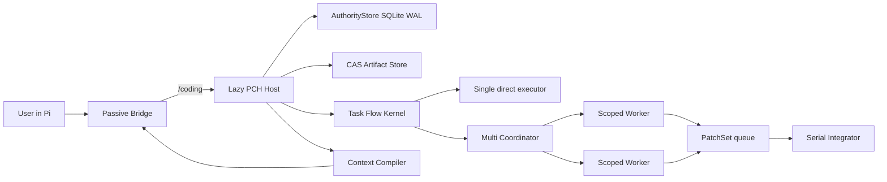
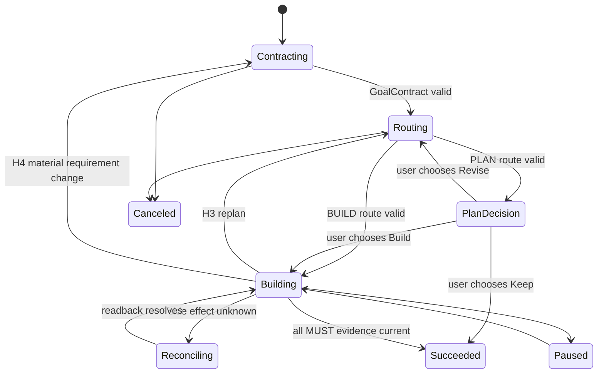

# Pi Coding Harness implementation blueprint

Status: authoritative implementation specification  
Version: 1.2.1  
Authority schema: 19  
Updated: 2026-07-27

This is the only architecture authority for Pi Coding Harness (PCH). Supporting documents may explain
implementation order, user operation, budgets, or gates, but cannot change a contract in this file.

## 1. Product definition

PCH is an opt-in harness outside Pi Coding Agent. It turns one user-selected coding task into a durable,
evidence-driven software-engineering run. Pi remains the interactive shell and model client; PCH owns task
authority, execution admission, context additions, recovery, optional Worker isolation, and verification closure.

PCH is not an autonomous chat replacement, a provider proxy, a server-side cache, or a claim that the model sees
less native Pi history. Its leverage comes from selecting small additional context, keeping exact local state, and
using short-lived role-isolated Worker sessions when decomposition has positive expected value.

### 1.1 Required outcomes

| ID | Outcome | Acceptance |
|---|---|---|
| PCH-G-001 | Native Pi outside Harness | Without a current explicit `/coding` entry or a previously explicit, authority-validated same-session auto-resume binding, Host starts=0, SQLite opens=0, RPC=0, prompt additions=0, extra model/provider requests=0. Auto-resume attaches the exact Goal but never starts a model/provider request. |
| PCH-G-002 | Fast reliable Single | A narrow Build can use one GoalContract, one DirectCell, one fresh oracle, and one delivery closure. |
| PCH-G-003 | Useful Multi | Independent shards may run concurrently in scoped mirrors; canonical writes integrate serially with preimage and oracle checks. |
| PCH-G-004 | Plan that can continue | Plan is reviewed in the current turn, frozen, and followed by an explicit Build/Keep/Revise choice. |
| PCH-G-005 | Evidence-driven correction | A disproved assumption or repeated failure changes the route instead of repeating stale work. |
| PCH-G-006 | Exact recovery | Goal, route, current subject, pending effects, Worker frontier and next action survive restart and compaction. |
| PCH-G-007 | Bounded context cost | PCH additions are deterministic, budgeted, stable-prefix aware and retrievable on demand. |
| PCH-G-008 | Honest optimization | No cache, token, latency or target-performance benefit is claimed without attributable evidence. |
| PCH-G-009 | Bounded autonomous progress | Repeated turns without authority or unique-evidence progress are detected locally and an unchanged managed route is refused. |

### 1.2 Non-goals

- Changing the user's provider, model, thinking level, context window or credentials.
- Running a hidden planning, critic, summarizer, memory, review, or rewrite model request.
- Letting Worker narrative, chat, Markdown, Widget or Pi JSONL authorize a side effect.
- Guaranteeing a cache hit rate, exact ETA, exactly-once external delivery, or universal performance improvement.
- Copying secrets, dependency directories, build output, Git internals or unrestricted workspaces into Workers.

## 2. Final design audit

The current implementation and every active capability were rechecked against correctness, user wait, context
growth, failure recovery, privacy, configuration authority and testability. The following decisions supersede all
earlier drafts.

| ID | Finding | Decision | Implementation evidence |
|---|---|---|---|
| PCH-AUD-001 | An always-loaded in-process runtime would tax ordinary Pi use. | Replace with passive Bridge plus lazy authenticated Host. | `src/bridge/register.ts`, `src/harness/host/client.ts` |
| PCH-AUD-002 | A full PRD for every Build creates avoidable model/tool work. | Build uses the smallest complete GoalContract and 1-3 near WorkCells. | `src/task-flow/admission.ts`, `src/runtime/task-flow-session.ts` |
| PCH-AUD-003 | Plan without a continuation action strands useful work. | Freeze, show Build/Keep/Revise in Pi UI, persist explicit choice. | Bridge `continuePlan`; Task Flow continuation tests |
| PCH-AUD-004 | A second critic request raises latency and can disagree with the first plan. | Review route within the same normal Agent turn; deterministic validators decide authority. | workflow prompt plus `submit_route` validator |
| PCH-AUD-005 | Unbounded automatic retry wastes time and tokens. | Normalize failure signatures; retry limit 0-3; then repair, replan, ask or reconcile. | `plan-health.ts`, Worker failure path |
| PCH-AUD-006 | Direct concurrent writes can corrupt the workspace. | Workers write only mirrors; PatchSets integrate serially after preimage checks. | `worker/executor.ts`, `integrateHarnessPatch` |
| PCH-AUD-007 | Worker context can leak Supervisor-private memory. | Only explicitly bound `VERIFIED_SHARED` claims enter TaskPacket. | memory visibility binding tables and tests |
| PCH-AUD-008 | Copying an entire repository into each Worker is expensive. | Copy declared minimal roots, ignore heavy/sensitive trees, enforce file/byte caps. | scoped mirror implementation |
| PCH-AUD-009 | Synchronous telemetry delays provider calls. | Provider begin/settle use an ordered background observation queue and flush at boundaries. | Bridge provider hooks |
| PCH-AUD-010 | Repeated full tool results inflate IPC/context. | Hash and bound IPC payload; preserve full evidence in CAS; rehydrate only when live. | `boundedResult`, Input Context capture/tool |
| PCH-AUD-011 | Automatic memory based on arbitrary text risks false durable claims. | Guarded deterministic capture accepts explicit durable directives or verified decisions; manual path remains. | Memory v3.1 capture and Vault tests |
| PCH-AUD-012 | Physical deletion conflicts with immutable audit history. | Forget hides reversibly; purge cryptographically destroys current Vault material and records proof, retaining non-content audit. | Memory purge intents/receipts |
| PCH-AUD-013 | Prefix metrics without provider usage evidence are misleading. | Activate provider-specific C1 only for a hash-bound, pre-activation usage window; positive reads are HIT and normalized zero remains UNOBSERVABLE. | Cache v2 runtime/repository and provider evidence manifest |
| PCH-AUD-014 | A universal Cache Adapter before two providers is speculative. | Keep provider-specific integration; extract a neutral seam only after two contract-equivalent adapters. | config validation and C0 fallback |
| PCH-AUD-015 | Smaller context can increase misses or compaction churn. | Runtime-derived budgets; append-only generation; native compaction only at safe frontier. | Input Context budget and Compaction 2.1 |
| PCH-AUD-016 | Output hiding alone does not reduce generated tokens. | Stable short instruction, tool-time silence, Widget dedupe and complete accounting; no rewrite request. | output policy and provider-turn ledger |
| PCH-AUD-017 | Generic profiling of every project slows small tasks. | Baseline guard by default; profile only with evidence or explicit request and a bounded workload contract. | target performance Module |
| PCH-AUD-018 | Mutable status files can become a competing ledger. | Product state remains SQLite/CAS; project status is a checked development projection only. | lifecycle and state scripts |
| PCH-AUD-019 | Broad legacy documents and commands cause route drift. | Delete them; one blueprint, five supporting documents, compact manifests. | release tree validation |
| PCH-AUD-020 | Fixed Pi version assumptions age poorly. | Probe current installed package; constrain only the tested peer range and fail clearly outside it. | package peer range and lifecycle doctor |
| PCH-AUD-021 | A frozen contract can omit or distort a user acceptance facet while remaining structurally valid. | Persist exact bounded intake and an immutable AcceptanceLedger in the same authority transaction as the GoalContract. | SQL 018, `acceptance-ledger.ts`, authority fault tests |
| PCH-AUD-022 | One-shot lane classification either over-plans small work or oscillates after new evidence. | Qualify the proposed route against current evidence, permit one initial correction, and use hysteresis for later promotion. | route finalization v2 tests |
| PCH-AUD-023 | Recording H3 without changing authorization lets an invalid route continue. | H3 atomically revokes execution, invalidates affected evidence and opens RouteRevision; H4/H5 similarly enter their required state. | Task Flow repository and recovery tests |
| PCH-AUD-024 | Multi-file integration can crash after a partial canonical apply. | Prepare a hash-bound PatchTransaction journal with CAS preimages before apply; compensate or enter H5 without blind retry. | SQL 019 and PatchTransaction fault tests |
| PCH-AUD-025 | Reprojecting the full Pi message history on every context hook adds hashing and IPC work. | Exchange append deltas bound by lineage/count/sequence root; mismatch forces one bounded full reconcile. | projection delta and Bridge/Host tests |
| PCH-AUD-026 | Provider turns and prose can masquerade as progress and sustain expensive loops. | GenerationGovernor counts only authority/evidence delta, nudges after two unchanged turns, and refuses a previously stalled identical managed route. | Governor unit/Host/Bridge tests |
| PCH-AUD-027 | A fake Single `SUPERVISOR` shard adds transactions without isolation or scheduling leverage. | Single Pi Agent executes the authorized WorkCell directly; WorkShard/TaskPacket/WorkerRun exist only in Multi. | Harness authority and Task Flow tests |
| PCH-AUD-028 | Returning both a transition message and the complete status line repeats model-visible text. | Put full state in the deduplicated Widget and return only the business message plus missing `next/health/blocker` deltas. | Bridge output regression test |
| PCH-AUD-029 | A ControlFrame captured only at Agent-run start becomes stale after a same-turn Contract, Route or Operation transition. | Every authority-changing Host result returns a compact fresh frame receipt; Bridge installs it before another managed action. | same-turn flow and managed lifecycle Bridge tests |
| PCH-AUD-030 | Vague optional Route fields make the model guess enums and allow unknown fields to be silently discarded. | Publish the exact compact proposal shape, omit empty optional arrays, and reject every unknown root or nested proposal field before persistence. | workflow prompt and finalization tests |
| PCH-AUD-031 | Repeating the complete Route on every correction amplifies output/input and can persist a semantically unchanged revision. | RouteRevision accepts replacement current/near WorkCells plus changed metadata; Host reconstructs prior metadata, reruns full finalization, then rejects unchanged effective execution semantics. | `route-revision.ts` and Task Flow regressions |
| PCH-AUD-032 | Pi recovery may expose a complete assistant message at `turn_end` without an extension-visible `message_end`, losing provider usage. | Settle from either hook through one idempotent in-memory turn owner; a second signal is a no-op and unresolved turns remain honestly unknown. | Bridge provider accounting tests |
| PCH-AUD-033 | A model timeout above the local oracle ceiling creates a predictable rejection/retry turn. | Normalize a finite tool timeout to 1-900 seconds before applying the frozen oracle policy; do not widen the authority ceiling. | Task Flow timeout-clamp regression |
| PCH-AUD-034 | Restricting reads to only the current WorkCell prevents efficient inspection of already frozen near-horizon files. | Single Supervisor may read all frozen Route read/write roots; mutation remains restricted to the authorized WorkCell write roots. | Task Flow Route-scope regression |
| PCH-AUD-035 | Requiring a separate fresh read before every exact edit adds model turns even when the edit carries a decisive preimage. | A bounded unique, non-empty, non-overlapping exact `oldText` set may prove current source locally; all ambiguous, broad or changed inputs keep the fresh-read gate. | Input Context evidence regression |
| PCH-AUD-036 | A frozen oracle allowlist can reject a cheap impact-driven check, then let a narrower passing oracle close obligations while the locally discoverable regression remains untested. | Statically safe local supplemental validation runs as a managed Operation but is explicitly non-attesting; failure drives repair, while only the frozen oracle may attest obligations or close work. | Oracle policy and Task Flow supplemental-validation regressions |
| PCH-AUD-037 | Quoted search regexes and exact built-in globs can be misclassified as external or out of scope, while an opaque formatter write cannot be reconciled safely. | Parse shell quoting before classifying operators, resolve exact grep globs to the actual file, and manage one-file or bounded same-command `gofmt -w` targets as per-file EDIT Operations with fresh-source proof and readback. Command expansion, workspace escape, mutating probe flags, pipelines, non-Go targets and batches above eight remain fail-closed. | Effect normalization, Input Context and Task Flow regressions |
| PCH-AUD-038 | Baseline manifests can exceed the SQLite authority limit only after a Route is frozen, and a later successful authorization can retain the old preflight blocker, causing redundant RouteRevision turns. | Enforce the exact authority manifest budget before persistence and clear the transient blocker only after successful fenced authorization. | Task Flow authorization-preflight regressions |
| PCH-AUD-039 | A model can change a shared entry point while proving only the new behavior, overlooking explicit preservation outcomes and consuming a full evaluator run to discover the regression. | The existing BUILD turn now requires direct-caller inspection and local evidence for each preservation outcome, using safe supplemental validation immediately when risk appears; no critic, planner or extra provider request is added. | Workflow-prompt and supplemental-validation regressions |
| PCH-AUD-040 | A formatter write chained to validation is correctly denied but can fall through to a generic external-effect message, leaving the Agent without a deterministic low-cost recovery action. | Recognize a valid leading local formatter before classifying safe conjunctions, retain fail-closed external authority for the composed command, and instruct the current turn to issue one bounded formatter call for up to eight authorized Go files followed by a separate validation call. | Effect normalization and Task Flow formatter-recovery regressions |
| PCH-AUD-041 | A bounded line-count probe can be misclassified as an external effect, consuming a Provider turn even though it neither mutates state nor crosses the frozen workspace. | Admit `wc` through the same quote-aware, expansion-denying and workspace-path checks as existing local probes; traversal and indirect file-list escape remain fail-closed. | Effect-normalization positive and escape regressions |
| PCH-AUD-042 | A successful managed edit is already locally read back, but leaving only the pre-edit source receipt active forces another Agent read before a formatter or later mutation. | Capture the successful managed mutation postimage as the next exact-source receipt and validate its hash again at the next mutation; failed, secret-refused, missing-path, restarted or externally changed evidence is never promoted. BUILD guidance requests reread only for missing or stale source. | Input Context mutation-evidence and workflow-prompt regressions |
| PCH-AUD-043 | A local version-metadata probe can be misclassified as an unknown external effect, forcing an unnecessary user Decision and Provider recovery turn. | Admit only the explicit read-only `git describe` subcommand through the existing quote-aware, expansion-denying, workspace-path and dangerous-option checks; arbitrary Git commands and mixed-effect shell composition remain fail-closed. | Effect-normalization positive and mixed-effect regressions |
| PCH-AUD-044 | A passing terminal oracle can auto-close authority while the current Agent turn is still reviewing preservation coverage, rejecting a legitimate correction and allowing locally under-tested work to appear complete. | Fresh terminal oracle Operations attest immediately but keep the final WorkCell writable for preservation review. Any later mutation clears in-memory validation readiness and requires fresh oracle evidence; explicit `coding_flow complete` or the existing local `agent_settled` RPC closes only a still-ready WorkCell without another provider request. Non-terminal WorkCells retain immediate evidence-backed progression. | Task Flow terminal-review, Host settle and Bridge contract regressions |
| PCH-AUD-045 | Forcing one provider turn per formatter target adds avoidable latency and tokens when all files are already inside one authorized WorkCell. | One safe `gofmt -w` call may contain two through eight unique workspace-relative Go files. Authority atomically prepares the batch, then preserves an independent preimage, lease/fence, OperationAttempt, reconcile locator, postimage readback and commit for every target. Any scope escape rejects the entire batch before durable prepare; Host promotes every successful postimage as fresh source evidence without another provider request. | Bounded 8/9 normalization, atomic scope rejection, per-file commit and Host postimage-reuse regressions |

No known higher-order correctness or safety issue remains in the implemented scope. External effectiveness remains
conditional where provider behavior or real workloads are required; those limits are not implementation PASSes.

## 3. System architecture



### 3.1 Process ownership

| Process | Owns | Must not own |
|---|---|---|
| Pi main process | UI, user session, current configured model, native provider request | durable PCH authority |
| Passive Bridge | command/tool registration, lazy Host lifecycle, compact hook transport | SQL, route decisions, Worker integration |
| PCH Host | authority, route, context additions, Worker orchestration, local telemetry | user credentials or provider mutation without integration |
| Worker session | one role and TaskPacket inside scoped mirror | canonical workspace, Supervisor history, durable authority |

The Bridge and Host communicate with newline-delimited authenticated JSON. Every request/response has a request ID,
nonce and HMAC. Replay, unknown fields, oversized data and mismatched responses fail closed. The 32-byte Host secret
is passed by environment once, deleted immediately in the child, and zeroed on shutdown.

### 3.2 Module map

| Module | Deep Interface | Main implementation |
|---|---|---|
| Bridge | `registerCodingHarness(pi)` | `src/bridge/register.ts` |
| Host | `dispatch(method, params)` | `src/harness/host/runtime.ts` |
| Task Flow | GoalContract -> RouteSkeleton -> WorkCell -> Operation -> Evidence -> Delivery | `src/task-flow`, `src/runtime/task-flow-session.ts` |
| Harness authority | Run, topology, shard, packet, Worker, PatchSet, integration | `src/harness/domain.ts`, `repository.ts` |
| Worker executor | `runReady()` | `src/harness/worker/executor.ts` |
| Context compiler/actuator | `prepare/project/context` | `src/input-context`, `host/context-runtime.ts` |
| Memory | capture/retrieve/correct/forget/purge | `src/memory`, authority repositories |
| Compaction | prepare/verify exact semantic capsule | `src/context/compaction-v21` |
| Cache | provider-specific observe/mutate arm with C0 fallback | `src/cache-v2` |
| Performance | frozen workloads, paired measurements, verdict | `src/performance` |

## 4. Entry, intent and topology

### 4.1 Zero-cost inactive state

At extension load, register `/coding`, `/memory` and four PCH tool definitions, then remove PCH tools from the active
tool list. Every ordinary event handler begins with an in-memory `active` check. It performs no
filesystem/config/Host work until explicit entry. `session_start` resets the active tool list, then scans only the
already-loaded current Pi branch for the latest `pi-coding-harness.session-binding.v1` custom entry. No marker means
the inactive path ends there. A marker is an untrusted discovery hint, never execution authority: only an exact
same-session `BOUND` head in SQLite may admit auto-resume. Invalid, stale, fork-inherited or substituted markers leave
PCH inactive without a lease or prompt injection.

The first successful explicit entry commits an immutable Goal/session binding revision and appends its non-secret
pointer to Pi JSONL. That prior opt-in permits later same-session Host discovery. Auto-resume restores tools, typed UI
projection and the exact authority frontier, but sends no user message, starts no Agent/Worker/provider turn and
performs no canonical mutation beyond bounded restart reconciliation already authorized by durable receipts. A live
controller is identified by both stable Pi session ID and an ephemeral runtime-instance nonce; a second runtime cannot
share the first runtime's fencing token. Graceful shutdown releases the lease by CAS, while crash recovery waits for
lease expiry. Explicit `/coding exit` appends an `UNBOUND` marker and commits the matching authority revision.

### 4.2 Entry grammar

```text
/coding
/coding [single|multi] [plan|build] <objective>
/coding recover [goal-id]
/coding new [single|multi] [plan|build] <objective>
```

With no arguments, `/coding` first offers the exact Goal bound to the current session, then other recoverable Goals in
the current workspace, and only then new intake. Recovery is selected by Goal identity, never objective wording,
session name, cwd similarity or browser state. Cross-session transfer is explicit, cannot steal an unexpired live
lease and atomically supersedes the prior control binding. Missing new-intake values are asked in Pi UI.
Recommendations are Single and Build because they have the lowest overhead for the common tightly coupled coding
task. Noninteractive new intake must supply all three values; noninteractive recovery supplies the Goal ID.

`Intent` and `Topology` are orthogonal:

| | Single | Multi |
|---|---|---|
| Build | Current Pi Agent implements the authorized WorkCell directly | Coordinator defines/runs only useful shards, then verifies canonical workspace |
| Plan | Current Pi Agent writes reviewed route, then asks continuation | Role-isolated planning/exploration may contribute; no canonical mutation before Build |

No old name or alias is accepted. Ordinary natural language never silently enters Harness.

## 5. Goal and route workflow



### 5.1 GoalContract

A contract contains objective, intent, lane, obligations, constraints, assumptions, non-goals, user Decisions and an
optional target-performance contract. Task text is printable NFC and at most 32,768 characters; larger specifications
are referenced by hash-bound project artifacts.

Acceptance V2 never infers authority from keyword, punctuation, conjunction count or lexical similarity. Intake first
stores exact UTF-8 bytes and byte spans. The current Agent turn may propose semantic facets and material unknowns, but
local code accepts only source-bound typed records:

```text
IntakeSourceV2
 -> SourceSpanRef
 -> AcceptanceFacetV2
 -> ConcernAssessmentV2
 -> ObligationV2(EvidenceRequirement)
 -> OracleExecutionReceiptV2
 -> OutcomeEvidenceBindingV2
 -> WorkCellCompletionReceiptV2
```

Every material unknown is declared as a stable `DecisionRequirementV2` before it is shown. A blocking unknown always
uses an immediate trigger, has a latest gate no later than contract freeze and must have a terminal user resolution.
A deferred Decision records its trigger, latest resolution gate, default, reversibility and affected obligations; real
WorkCell revision hashes are attached later by `DecisionPlanBindingV2`. Users can approve a draft, request an alternate,
edit a Requirement, defer a reversible Decision or cancel the Goal. EDIT binds the exact successor Requirement revision
and makes prior review receipts stale; a free-form replacement ID or an undifferentiated REJECT is not authority.

`ConcernAssessmentV2` closes the applicability frontier for the selected lane. Normal behavior, failure/recovery,
permission/security/privacy, migration/compatibility, performance/cost, UX/accessibility, rollback/operations and
non-goals are each `APPLICABLE` with Requirement/Decision refs, `NOT_APPLICABLE` with a rationale or `DEFERRED` with a
trigger. DirectCell uses a reduced profile, but no lane may call a draft complete merely because every already-proposed
facet has a Requirement.

Natural-language active-Goal classification is an untrusted proposal and can only preserve or reduce authority.
Classifying a captured turn as `DISCUSSION_ONLY` does not reopen mutation until a `DispositionAuthorityReceiptV2`
records the user's disposition; an explicit typed UI/command envelope may create that receipt without another model
turn. A material turn creates source-bound `ADD | MODIFY | REMOVE` Acceptance and Requirement deltas. Before execution
resumes, `ChangeAcceptanceClosureV2` proves every captured turn is absorbed by the successor Contract and that each
changed Requirement is reachable from a current WorkCell and Host-owned oracle. Direct Plan ancestry alone is
insufficient.

`GoalFitAssessmentV2` binds outcome fidelity, obligation coverage, unnecessary design, current user Decisions,
invalidations and gate-specific evidence. It is submitted in the current Agent turn; the Host validates the closure and
derives the verdict without a separate provider request. A qualified Decision closure cannot mechanically imply FIT.
Goal Fit review identity is exact-gate-instance-specific. Distinct Plan revisions may share the same Requirement revision,
gate and Decision closure, but each Plan subject requires a fresh assessment, review and binding; prior FIT authority is
never reused across gate subjects.
`ContractFreezeReceiptV2` is created with expected-head CAS only after the exact Requirement revision, source/facet/
concern closure, Decision closure and a fresh `GoalFitReviewReceipt` all match. Provider or Worker text can propose IDs but
cannot create spans, close Decisions, attest an oracle or freeze the contract. Legacy frozen contracts remain historical;
an unfinished V1 Goal must requalify before new execution authority is issued.

### 5.2 RouteSkeleton

The route contains typed assumptions, risks, alternatives, WorkCells, dependencies, budgets, read/write roots,
oracles and deferred outcomes. It expands only current and near work. Validity rules:

1. graph is acyclic and every dependency exists;
2. every MUST obligation maps to at least one WorkCell and oracle;
3. write roots are workspace-relative and bounded;
4. no effect occurs before authorization;
5. future uncertain work is a typed deferred outcome, not invented detail;
6. same-turn route review checks omission, unsafe assumptions, unnecessary WorkCells, cheaper valid alternatives,
   rollback and waiting cost before one submission.
7. proposals contain only the documented root and nested fields; unknown fields fail with the exact path instead of
   being silently ignored. Optional typed arrays are omitted when they add no decision value.
8. when no deferred outcome remains, local finalization projects every MUST oracle onto one terminal WorkCell and
   binds it after the other terminal cells, avoiding a model-visible validation-only stage;
9. a RouteRevision transports only 1-3 replacement current/near WorkCells and changed metadata. The Host reconstructs
   unchanged typed metadata from the frozen Route and reruns the same scope, DAG, oracle and acceptance validators;
10. RouteRevision no-op detection compares the fully finalized logical execution projection, not raw model bytes, so
    omitting locally generated closure fields cannot manufacture a new revision.

Plan entry is a two-event Host transition. `PLAN_VALIDATED` atomically freezes the current `PlanRevision`, Decision
closure and gate-instance-bound content-addressed `GoalFitReview`, then persists the internal `COMMIT_PLAN_GATE`
boundary. The following
`PLAN_FROZEN` event creates `StageGateReceiptV2`, binds the preceding event head and advances execution. Its event
sequence must be strictly greater than both the bound Plan and Goal Fit sequences. Restart resumes either boundary
locally under the same lease/CAS/idempotency rules; neither boundary adds a provider request or a model-visible action.

### 5.3 Specification classes and execution lanes

| Class or lane | Use | Planning overhead |
|---|---|---|
| BYPASS | conversation/no project mutation | no Host run should have been entered |
| DIRECT_CELL | one narrow low-risk change | minimal contract plus one WorkCell |
| ADAPTIVE_ROUTE | multi-file/moderate uncertainty | 1-3 near WorkCells plus deferred outcomes |
| FULL | high risk, migration, broad product behavior | detailed contract and route, still rolling |

The local classifier is authority-bound for managed admission and adds no model request. User profile/depth overrides
win. PRD always enters `ADAPTIVE_ROUTE`; deterministic route qualification may lower later execution overhead but may
not remove an acceptance or safety obligation.

Route qualification compares the intake hint, proposed lane and current evidence. It may reclassify the first route
once. After execution starts, `ADAPTIVE_ROUTE` is held unless new evidence justifies promotion; it does not oscillate
back to DirectCell. Every decision persists proposal, evidence candidate, prior lane and hysteresis action.

### 5.4 Route health and correction

After a meaningful tool result and at WorkCell exit, local code checks:

`bounded work -> receipt -> PlanHealth -> Continue | Retry | Local Repair | Replan | Ask User | Reconcile`.

| Level | Meaning | Action |
|---|---|---|
| H0 | healthy | continue |
| H1 | transient, bounded | retry within configured limit |
| H2 | local reversible defect | repair current WorkCell |
| H3 | technical route invalid | invalidate dependent current view and open RouteRevision |
| H4 | behavior/scope/acceptance/preference uncertain | ask one bounded recommended choice, then GoalContract revision |
| H5 | unknown side effect or state conflict | stop mutation and reconcile; fail only when no correction route exists |

New evidence invalidates affected receipts/artifacts in the current projection but never deletes history. Identical
failure signatures cannot retry indefinitely. Route choice is lexicographic: hard constraints/security, acceptance
reachability, evidence strength, quality/risk/reversibility, then requests/tokens/latency/interrupt cost.

H3/H4/H5 are state transitions, not advisory labels. H3 atomically revokes current authorization, invalidates affected
evidence and changes `next` to `SUBMIT_ROUTE`; H4 revokes mutation and changes `next` to `RESOLVE_DECISION`; H5 stops
mutation and changes `next` to `RECONCILE_OPERATION`. Recovery reconstructs the same next action.

At H3 the Agent submits `submit_route_revision`, not another complete Route. Valid prior metadata and completed
workspace changes are preserved locally; only the changed horizon and changed typed metadata cross the model/Host
Interface. An effectively identical route is rejected before authority mutation.

GenerationGovernor is a non-authoritative in-process guard around this loop. A provider request or assistant prose is
not progress. A changed ControlFrame or new hash-distinct tool evidence is progress. The first unchanged turn is
tolerated, the second receives one stable ephemeral nudge, and later attempts to repeat an already stalled identical
managed route are rejected. New user input, progress, waiting-user and terminal states reset the guard. It adds no
model request, does not truncate output, and cannot claim to cancel provider reasoning; Host restart safely resets it.

## 6. Single execution

Single creates no WorkShard, TaskPacket or WorkerRun. The current Pi Agent executes the authorized WorkCell with native
tools in the real workspace; Task Flow Operations provide all required accounting. For mutations:

1. normalize target and reject path escape or undeclared write root;
2. capture workspace baseline and create immutable OperationAttempt;
3. bind lease generation, fencing token, input closure and idempotency key;
4. mark dispatched immediately before tool start;
5. hash bounded tool result and read back the postimage;
6. commit, fail, or mark `OUTCOME_UNKNOWN`;
7. after final write run each declared oracle once;
8. map fresh PASS Operations to obligations; non-terminal WorkCells advance immediately;
9. keep the terminal WorkCell writable through the current Agent's preservation review, invalidate readiness on any
   later mutation, and close only through one explicit local completion or the existing `agent_settled` RPC;
10. when an explicit implementation Goal reaches its final WorkCell, reject closure unless the Goal contains a
   committed mutation; a user-confirmed no-change result requires a revised `READ_ONLY` GoalContract.

During BUILD, built-in reads may inspect any path already declared by any current/near WorkCell in the frozen Route.
Writes remain current-WorkCell scoped. A finite model-supplied validation timeout is clamped to the authoritative
1-900 second range before oracle evaluation, avoiding a rejection-only retry without extending execution authority.
An additional local validation command that passes the same static executable, workspace, network, output and timeout
policy may run as supplemental evidence even when it is absent from the frozen oracle. Its receipt cannot attest a
MUST obligation, advance final validation progress or close the WorkCell; a fresh frozen oracle remains mandatory.

Input Context keeps the fresh-source gate for existing mutation targets. For exact edit tools only, local code may
replace a separate read receipt with an optimistic preimage proof when every non-empty `oldText` occurs exactly once,
the edits do not overlap, the file is a non-link regular file at most 8 MiB, and edit arguments total at most 1 MiB.
Every other case requires the normal current exact-source receipt.

The ControlFrame fences each managed action, not an entire Agent run. Blocking tool preflight atomically persists the
OperationAttempt plus `PREPARED` and `DISPATCHED` transitions in one authority transaction immediately before Pi may
execute the tool; it does not depend on Pi's earlier `tool_execution_start` notification. Every successful
Contract/Route/control, Operation preflight, observation or recovery response carries the new frame hash. Bridge
installs that receipt synchronously before Pi may issue another managed action in the same turn. Stale model actions
remain fail-closed; a local status read refreshes the frame without requiring another provider request.

Read-only tools skip lifecycle IPC where no authority transition is needed. A successful committed write omits a
redundant tool-end call. This keeps the correctness gate while avoiding the former multi-call ceremony.

## 7. Multi execution

### 7.1 Requested topology and Multi Benefit Gate

`single` is a hard user limit. `multi` grants permission to evaluate Multi; it is not execution authority. A requested
Multi WorkCell first derives `PENDING_MULTI_PROPOSAL` from the current requested/effective topology and authorization
closure. Canonical mutation is fenced in that state. The Agent submits one minimal DAG proposal; the Host persists its
normalized nodes and exact closure in an immutable `DynamicMultiProposalReceiptV2` before any asynchronous measurement.
While the persisted proposal has no terminal gate, the derived state is `PENDING_MULTI_ADMISSION`; a Host restart resumes
admission from that receipt without another Agent turn. A denial enters `SINGLE_ACTIVE(reason)`. An allow enters
`MULTI_READY`, then `MULTI_RUNNING` and a durable terminal state. Each new or materially changed WorkCell derives a new
proposal/admission closure instead of inheriting the prior WorkCell's decision.

The Host writes a hash-bound `TopologyGateReceiptV2` only when all required conditions hold:

| Condition | Multi requirement |
|---|---|
| decomposition | at least two independent or low-coupling nodes |
| information | each TaskPacket has a sufficient exact input closure |
| mutation | concurrent write scopes are mutually exclusive |
| validation | node outputs can be checked independently |
| economics | conservative benefit exceeds startup, provider, communication, conflict and serial integration cost |
| quality | at least one of makespan, risk coverage, quality or user intervention improves without unacceptable regression |

Small tasks, incomplete specifications, one shared core file, strong sequential dependencies or high shared-context
needs remain effective Single. A Multi request that fails the gate creates zero Worker session, zero model-catalog
lookup and a visible typed reason. Gate estimates are calibrated only from comparable local telemetry; no warmup or
extra provider request is allowed.

Concrete Strong Single executions remain immutable Schema 33 provenance. Admission never searches by current Goal,
run, WorkCell or Plan identity and never accepts caller-supplied metrics. Schema 34 derives a workload key from exactly
13 explicit dimensions: WorkCell semantics; Requirement, obligation and Decision content roots; oracle set; scope;
effect policy; input content root; environment; runtime fingerprint; topology-neutral comparison config; provider
profile; and cache epoch. A prior PASS/complete-accounting Single is usable only after the Host persists an
`EXACT_MATCH` comparability receipt with every dimension checked independently. IDs, topology, timestamps and measured
performance are provenance and do not enter the key. Missing comparable evidence deterministically keeps the normal
user task Single; isolated Shadow qualification is allowed only in an explicit benchmark epoch.

### 7.2 Dynamic capability DAG

Fixed `PLANNER/EXPLORER/IMPLEMENTER/VERIFIER/INTEGRATOR` identities are V1 profile hints, not V2 topology or authority.
The V2 scheduler creates the minimum short-lived nodes required by the current DAG and evidence closure. Nodes are
defined by capability and output responsibility, for example `SOURCE_DISCOVERY`, `PATCH_PROPOSE`, `CONFLICT_PROPOSE`
or `ORACLE_REQUEST`. A node is not created when its marginal output is already covered; a pending node is canceled when
new evidence makes it irrelevant.

Dependency edges have typed readiness conditions: `EVIDENCE_ACCEPTED`, `PATCH_INTEGRATED` or `ORACLE_PASSED`. Worker
narrative, majority vote and model agreement satisfy none of them. `VERIFIER` and `INTEGRATOR` cease to be privileged
roles: Workers may propose observations or conflict patches, while the Host alone executes the canonical oracle and
serial integration.

### 7.3 TaskPacket V2 and communication

Every node receives one immutable `TaskPacketV2`:

| Closure | Required content |
|---|---|
| identity | Goal, Requirement, obligation, Plan, WorkCell, topology and authorization stable IDs/hashes |
| input | exact source/dependency refs, baseline/content root and freshness |
| Decisions | clarification, assumption, route, non-goal and topology-gate receipt refs |
| grant | capabilities, read/write roots, effect classes, network=false, byte/tool limits, lease/fence |
| provider | runtime source/profile/config fingerprint, ProviderCallPlan ref, budget and fallback; never credentials |
| stop | stop generation, deadline, turn/tool/token/retry/no-progress bounds |
| output | a versioned typed union and evidence requirements |
| oracle | `owner=HOST`, frozen oracle-set hash and covered obligation IDs |

The capability HMAC covers the complete packet, runtime binding and baseline, not an opaque subset. Large artifacts
remain in CAS and are transferred as hash refs; Workers receive neither Supervisor chat nor private Memory. Shared
context accepts only authority-verified records. Relay sufficiency is measured by replay: compression is rejected when
omitted information changes a downstream decision or oracle requirement.

Workers submit through one schema-validated local `submit_worker_result_v2` tool. Allowed variants are evidence
proposal, patch proposal, Decision request, conflict proposal, blocked or stopped. Free-form assistant text is display
only; absence of a valid typed submission is a protocol failure and cannot unlock a successor.

### 7.4 Runtime, mirror and privacy

The default runtime exactly inherits Supervisor provider/model/thinking/context. A user-configured capability profile
may select another model already present and authenticated in Pi; unavailable profiles fall back explicitly and record
the reason. No code calls `setModel`, changes the active Pi configuration or implicitly downgrades quality.

- Copy only declared roots into a fresh scoped mirror; reject symlink/reparse traversal and excluded secret/build roots.
- Apply the existing 8,192-file and 128-MiB hard cap unless a reviewed configuration narrows or widens it.
- Grant only declared local tools. Network, extensions, skills, prompt templates, context files and persistent Worker
  history remain disabled unless a future capability receives its own privacy and side-effect authority design.
- Risk, privacy and capability taint propagate along every DAG edge. A tainted proposal cannot enter a less-restricted
  node or provider closure without a new Host-approved binding.

### 7.5 Scheduling, integration, oracle and stop

The scheduler continuously backfills free slots from the authority DAG instead of launching one ready wave. Ordering is
deterministic by MUST reachability, longest remaining critical path, deadline and stable ID. Read-only exploration,
independent validation and mutually exclusive PatchSets may overlap; canonical integration remains one serial queue.

```text
WORKER_PROPOSED
 -> PATCH_PREPARED
 -> INTEGRATED
 -> ORACLE_PENDING
 -> ORACLE_PASSED
 -> WORKCELL_COMPLETION_ELIGIBLE
```

`APPLIED` is never `SUCCEEDED`. After each PatchSet, the Host runs the frozen fresh oracle through the normal Operation
lifecycle against the current postimage root. A receipt binds the complete integration set, obligations, environment
and topology revision. A terminal WorkCell still requires preservation review and Acceptance V2 closure.

The existing scoped mirror, sensitive-file exclusions, lease/fence/CAS, PatchSet journal, per-file preimage checks,
unknown-outcome reconciliation and serial canonical integration are retained. Role-based result inference, patchless
automatic success, one-shot wave scheduling, `getLastAssistantText()` as a protocol, eager five-role runtime maps and
`APPLIED => job success` are replaced.

A stop first commits `StopDirectiveV2`, increments `stop_generation`, fences late results and cancels undispatched
nodes. Only then does the Host request bounded Worker abort/drain. User cancellation never becomes a transient retry;
restart restores the same canceled frontier. Retry, handoff, replan and fan-out each have durable hard limits, so no
Worker or Agent chain can loop indefinitely.

## 8. Durable authority and schema

### 8.1 Authority rules

- SQLite WAL and local filesystem are required.
- Events, receipts, revisions, operations, Worker transitions and measurements are append-only.
- Heads and status rows are rebuildable projections; immutable records and CAS are authoritative.
- Every command is hash-bound and idempotent. Version mismatch, stale lease or stale fencing token rejects mutation.
- CAS locator format is `pch-cas://sha256/<hex>` and bytes are verified on open.

### 8.2 Forward-only migrations

| Version | Purpose |
|---:|---|
| 001 | core goals, events, receipts, effects, leases, checkpoints and CAS metadata |
| 002 | experiment epochs and performance observations |
| 003-007 | first memory history, FTS and checkpoints retained for forward compatibility |
| 008-010 | Memory v3 Vault, lifecycle and guarded capture |
| 011 | GoalContract, RouteSkeleton, WorkCell, Operation, evidence and delivery |
| 012 | Input Context candidates, envelopes, projections and provider-turn ledger |
| 013 | ManagedRun, topology, shards, packets, Worker runs, PatchSets and integrations |
| 014 | Cache v2 partition, request and observation records |
| 015 | Compaction 2.1 attempt/transition frontier |
| 016 | provider-turn ledger v2 contribution attribution |
| 017 | target-project performance measurements and verdicts |
| 018 | exact Task Flow intake evidence and immutable AcceptanceLedger |
| 019 | PatchTransaction preparation journal and integration binding |
| 020 | Authority/Acceptance V2 evidence requirements, oracle execution, completion and deliverable manifests |
| 021 | IntakeSource, Decision, Requirement revision, Goal Fit and contract-freeze authority |
| 022 | Plan transition, stage gates, Change Request, invalidation, reuse and correction budgets |
| 023 | dynamic capability DAG, TaskPacket V2, stop directives and Provider Invocation records |
| 024 | active-Goal input capture, classification authority, Change Request binding and transition closure |
| 025 | typed Goal Fit gate instances, assessments and review bindings |
| 026 | forward-only Goal Fit review identity correction for distinct exact gate instances |

Upgrade requires the exact predecessor and stored SQL SHA-256. It takes a SQLite backup, verifies backup integrity,
applies migrations transactionally, verifies domain repositories/foreign keys/integrity, and restores the backup on
failure. There is no backward schema migration; rollback uses the previous runtime against a pre-upgrade backup only.
V2 uses additive tables, a single V2 writer and explicit legacy readers. Historical terminal V1 Goals remain readable.
An unfinished V1 Goal cannot be silently backfilled with invented source spans, Decisions or oracle receipts; it must
enter an explicit requalification path before receiving new authority. A V2 stage is not enabled until migration,
integrity, rebuild, crash replay and arbitrary-cwd package tests all pass.

### 8.3 Recovery precedence

On Host restart: verify SQL/integrity -> take or renew goal lease -> rebuild heads -> recover or reconcile open
PatchTransactions -> reconcile pending Operations -> fence orphaned Workers -> restore latest Goal/route/subject ->
verify compaction frontier -> authorize only the exact next action. An unresolved side effect outranks all execution.
Completed receipts are reused only when their declared input closure still matches.

On a live Host, an unexpired lease is reused while more than half of its configured TTL remains. At or below that
threshold it is renewed with the latest progress sequence; after expiry it is reacquired. This removes redundant
FULL-durability renewal writes from the hot path without weakening the in-transaction lease generation and fencing-token
check performed by every authority mutation.

## 9. Memory v3

Memory combines manual control with `GUARDED_AUTO` capture.

### 9.1 Capture

Local deterministic classification observes user input only while Harness is active. It accepts explicit durable
directives or verified user decisions and rejects quotations, temporary instructions, uncertainty, secrets, commands,
oversized text and ambiguous preferences. It adds no model request. Uncertain candidates are proposed rather than
silently activated. Manual `/memory remember` always remains available.

### 9.2 Storage and retrieval

- Claim metadata and lifecycle events are immutable SQL records.
- Body is encrypted in the workspace Vault; integrity binds workspace, claim, version and AAD.
- Retrieval uses scoped structured terms/FTS, validity, conflict checks and token quotas.
- Selection order favors policy, then evidence, then experience; contradictory policy is not merged silently.
- At most the configured working set is projected through the sole Context Compiler.
- Multi receives no memory unless an explicit `MemoryVisibilityBinding` marks the exact claim/version
  `VERIFIED_SHARED` for the run.

### 9.3 User lifecycle

`forget` creates a reversible visibility action. `correct` appends a superseding version. `purge` requires explicit
scope and cryptographically destroys reachable body/key material in the current data root, recording purge intent and
receipt. Immutable non-content audit remains so recovery does not resurrect deleted text.

Failure of Vault, index or capture falls back to empty optional projection or manual capture; it never blocks core
coding or changes Pi configuration.

## 10. Input Context

`ContextCompiler` is the only selection policy Module. `PiContextProjector` is the only provider-visible PCH actuator.
Memory, Cache, Output and Compaction submit contributions but cannot independently rewrite history.

### 10.1 Turn preparation

1. hash the native Pi system prompt and cache at most two known bases;
2. build deterministic workflow, protected authority and stable output-policy additions;
3. derive runtime fingerprint from current Pi configuration;
4. compile candidate evidence against subject, acceptance, validity and token budget;
5. emit a canonical layout manifest and tool-surface plan;
6. inject only bounded working-set content; expose deferred evidence with `coding_context`.

One canonical `BudgetEnvelope` derives from the actual context window, current input usage, output reserve and bounded
unknown usage. The same envelope drives evidence selection, pressure, ProviderCallPlan admission and UI telemetry;
pressure is monotonic in remaining headroom and zero headroom can never be `LOW`. The compiler degrades
`EXACT -> STRUCTURAL -> DEFERRED` before failing, never drops protected authority, and falls back to Pi baseline on
unknown projection outcome.

### 10.2 Deferred retrieval

`coding_context` supports `CURRENT_ON_DEMAND`, `CURRENT_WORKING_SET`, optional exact candidate IDs, `EXACT` or
`STRUCTURAL`, and signed expiring cursor continuation. Requests allow 1-10 candidates and bounded bytes. Cursor and
selector forms cannot be mixed. CAS evidence is revalidated against current subject/authorization before delivery.

### 10.3 Honest scope

PCH does not remove or summarize Pi's native full conversation. It prevents PCH from adding repeated full plans,
tool results, memory and status; Multi additionally gives each Worker a fresh small session. Provider-turn accounting
separates uncached input, cache read/write, output, reasoning, tool arguments and unattributed values without storing
raw prompt content.

### 10.4 Provider-turn completion

Bridge opens a keyed attempt at `before_provider_request` and settles it from the first matching complete
assistant-message surface. The key is `{provider_call_plan_id, logical_request_id, attempt_id}`; baseline Pi turns use a
typed baseline origin rather than a fake PCH plan. Normal Pi delivery uses `message_end`; Pi 0.82.x recovery may require
the equivalent `turn_end` fallback. Clearing the matching key before queued settlement makes duplicate hooks idempotent.
Starting attempt B never closes pending attempt A. Only an explicit timeout, shutdown reconciliation or restart recovery
may mark an unresolved key `OUTCOME_UNKNOWN`, and each Cache request binds the same key. Settlement remains ordered in
the background and does not delay provider dispatch.

Usage normalization belongs to the selected provider Adapter. Its contract declares `usage_semantics_id`, finality and
mutually exclusive uncached/cache-read/cache-write/output/reasoning buckets. Unknown or aggregate-only semantics remain
`PARTIAL` or `UNOBSERVABLE`; generic ledger code never assumes a provider's input total excludes cached tokens.

## 11. Compaction 2.1

PCH uses Pi native compaction. Before it starts, local code requires zero pending Operations and unresolved Workers,
then atomically stores a capsule hash over Goal/route/WorkCell, Harness frontier, execution subject, context seed,
next action and pending IDs. After compaction it rebuilds authority and compares the semantic frontier. Match commits
`VERIFIED`; mismatch commits `RECOVERY_REQUIRED`, blocks mutation and requires reconciliation. A Host crash during the
Pi-owned interval is recovered at the next boundary. No additional summarizer request is created by PCH.

Provider-backed qualification against Pi 0.82.1 confirms both paths. A completed manual native Compaction stored
`PREPARED -> PI_OWNED -> VERIFIED(EXACT_FRONTIER_RESTORED)` with SQLite integrity `ok`, no foreign-key violation and
zero pending Cache or Provider ledger rows. A second run was terminated only after durable `PI_OWNED`; after the
30-second execution lease expired, restart committed `VERIFIED(RECOVERY_EXACT_FRONTIER)` with zero Provider tokens and
the same zero-pending closure. The combined receipt is
`reports/PROVIDER-BACKED-COMPACTION-VALIDATION.json` (SHA-256
`2EA6261EA60811166FDB3701B9FE31224FA28EF42EFA008CE655CF6F00D33C3C`). Immediate takeover of an unexpired lease remains
forbidden because it would weaken fencing. RPC controllers must also wait for Pi's `agent_settled`; a successful
`prompt` response proves only preflight acceptance and cannot authorize Compaction or another dependent command.

## 12. Cache v2

The current release activates non-mutating `C1_PREFIX` only when the selected Pi runtime matches one exact,
provider-specific contract. Supported contracts are `geekspace/openai-completions` at its verified HTTPS base URL and
`codex-local/openai-responses` at the verified loopback relay. The configured integration ID, wire API and normalized
base URL must match. A Pi custom-provider ID is a user-owned profile label rather than a protocol identity, so it is
normalized and retained in the Cache security partition instead of compared with a magic literal; distinct profile
IDs remain distinct partitions. Any unmatched API or base URL falls back to `C0`.

The Geekspace pre-activation window contains 200 normalized provider responses across 11 sessions: 138 report positive
`cacheRead`, 20,424,704 Cache-read tokens are attributable, and the descriptive token-read share is 76.69%. The
codex-local PRD-01 epoch 007 then closed 57 ordered logical requests with 57 attributions and zero pending records:
53 had positive provider-usage `HIT` evidence, with 2,196,224 Cache-read tokens, 112,380 uncached-input tokens and no
additional model or provider request. On 2026-08-01, a frozen minimal qualification of the active
`codex_local_access/openai-responses/gpt-5.6-sol/max` Pi profile reported 3,840 Cache-read tokens, 967 uncached-input
tokens and 11 output tokens on its first request; the second planned request was cancelled immediately under the
predeclared decisive-evidence stop rule. These values authorize observation and stable-prefix governance, not a future
hit-rate guarantee. Pi 0.82.1 maps an absent cached-token field to zero, so positive values are `HIT` with
`PROVIDER_USAGE` evidence while zero remains `UNOBSERVABLE`; it is never relabeled `MISS`.

The integration does not alter payloads, add headers, warm up the cache, delay requests, pin a model, or issue a model
request. A provider/API/base-URL mismatch immediately makes the effective arm `C0` while the configured arm remains
visible in `/coding cache`. C2-C4 remain unavailable until the provider documents a concrete request contract and a
separate live canary proves correctness, latency and net-token non-inferiority.

Provider/model/base URL/security changes rotate lineage. Prompt/tool/compaction changes create explicit prefix
generations. PCH never adds warmup requests, filler tokens, undocumented headers, delayed user requests or selective
denominators. A provider-neutral `CacheAdapter` becomes a real seam only after two independent provider integrations
pass the same Interface contract; one implementation remains a provider-specific Module.

Adapter selection and partitioning use the same Adapter-produced canonical transport identity. Conservative
normalization may fold provider casing or a semantically empty trailing slash, but userinfo, query, API path or any
Adapter-meaningful transport change rotates lineage. No provider-global URL normalizer may broaden reuse.

## 13. Output governance

The stable provider-visible policy is intentionally short: use tools silently; report questions, blockers and final
evidence; preserve requested format. Transition responses project their included status directly into a debounced
Widget, without a follow-up status RPC. Their model-visible result contains only the transition's business delta and
any missing `next`, nonhealthy `health`, ready-shard or blocker hint. Successful internal Operations omit diagnostic
IDs; failures include one local correlation ID. Large details live in artifacts or on-demand commands.

Accounting distinguishes generated assistant text, reasoning, tool-call arguments, tool-result transport, directive
input and locally suppressed progress. UI hiding is not counted as token savings. Required slots and user formats may
exceed soft budgets. PCH never hard-truncates required output or sends a second model request to rewrite it.

## 14. Target-project performance

Performance is a first-class optional obligation, not automatic profiling. Route selection prefers a faster path only
after correctness, safety and acceptance are tied. Optimization starts when the user requests it or evidence identifies
a material hotspot and a representative workload exists.

A valid contract freezes PRIMARY, REGRESSION and candidate-blind HOLDOUT workloads, environment, metric direction,
correctness oracle, practical threshold, max trials, max blocking time and rollback. Candidates run paired valid
samples. Any correctness regression rejects the candidate regardless of speed. Unknown/noisy evidence remains advice.
PCH overhead and target-project performance are always reported separately.

## 15. Security and privacy

- Paths are canonical, workspace-contained and checked against declared roots; symlinks in Worker scope fail closed.
- IPC is HMAC-authenticated and replay-protected; content transport is bounded.
- Secret-like Worker narrative/patches are rejected before persistence.
- Telemetry stores hashes, counts and reason codes, not raw provider prompts or credentials.
- SQLite permissions and local-filesystem requirement are checked by lifecycle.
- Unknown external side effect is reconciled by readback; never blindly retried.
- Uninstall deletion requires an install marker, explicit flag and confirmation. Export cannot overlap data root.

## 16. User Interface

PCH keeps Pi's native chat input and one authority. The compact Widget shows the Goal title, topology,
current WorkCell, next action and any blocker or evidence delta. Normal tool work remains silent; the
Agent reports only decisions, blockers and final verified evidence.

Material choices use Pi's native `select` and `editor` interactions. Status text, Worker output and
session metadata remain projections only: they cannot authorize a mutation, replace SQLite authority or
bypass the current ControlFrame. Pause, restart and native compaction restore the same durable Decision
state without asking the user to restate the task.

## 17. Performance budgets

The full numeric contract is in `docs/PERFORMANCE-BUDGET.md`. Hard principles:

- inactive synchronous overhead is effectively one null check per registered hook and no I/O;
- Single local control P95 must remain below the documented budgets;
- no ordinary turn waits for telemetry/index cleanup;
- Multi is admitted only when expected benefit exceeds Worker startup/copy/integration overhead;
- optional Module over-budget or failure bypasses to its documented baseline without weakening authority;
- every vertical slice runs affected RED/GREEN tests, an independent design review when material, adversarial/fault
  checks, affected integration and a local cost/performance comparison before the next slice broadens scope;
- full release, installation refresh and manifest regeneration occur once at the stable release boundary, not after
  every edit. Hash-bound reviewers recheck only changed closure members.

## 18. Lifecycle and packaging

The project is self-contained: active paths use project-relative imports and files. `install.ps1` builds runtime,
creates/updates the marked data root, applies schema and runs `pi install <root>`. `doctor.ps1` is read-only.
`upgrade.ps1` backs up then migrates. `uninstall.ps1` preserves data unless explicit export/delete is confirmed.

Release must work from an unrelated cwd and must not depend on source history, reports, `node_modules` copied from a
different root, or absolute development paths.

## 19. Acceptance matrix

| ID | Required evidence |
|---|---|
| PCH-ACC-001 | clean `npm ci`, compile, lint, build and all Vitest suites |
| PCH-ACC-002 | SQL 001-035 apply in order; immutable triggers, foreign keys and integrity pass |
| PCH-ACC-003 | JSON and Markdown validators pass; blueprint is unique |
| PCH-ACC-004 | inactive Bridge test proves zero Host/RPC/prompt/provider activity |
| PCH-ACC-005 | Single end-to-end mutation has prepare/readback/fresh oracle/delivery |
| PCH-ACC-006 | Multi concurrent Workers use scopes; conflicts/fencing/recovery/integration are tested |
| PCH-ACC-007 | PLAN continuation Build/Keep/Revise and H3/H4/H5 routes pass |
| PCH-ACC-008 | Memory capture/privacy/tamper/purge and Input Context exact/deferred/fallback pass |
| PCH-ACC-009 | Compaction frontier survives restart and rejects mismatch |
| PCH-ACC-010 | lifecycle install/upgrade/uninstall and arbitrary-cwd installed Pi probe pass |
| PCH-ACC-011 | measured P50/P95 budgets pass without extra model/provider requests |
| PCH-ACC-012 | no secret, old public name, fixed model/thinking/window, reparse link or external runtime dependency |
| PCH-ACC-013 | verified provider gets C1 positive-usage attribution; zero remains unknown and unsupported runtimes fall back to C0 |
| PCH-ACC-014 | exact intake/AcceptanceLedger, route hysteresis, automatic H3/H4/H5 transition and Single zero-shard semantics pass |
| PCH-ACC-015 | PatchTransaction crash recovery, projection-root reconciliation and GenerationGovernor repeated-route refusal pass |

## 20. Implemented status and evidence boundary

This blueprint is the sole current/target architecture authority, but it is not an implementation receipt. The local
authority schema now extends through 035: Acceptance/Authority V2, Intake/Decision/Goal Fit, Plan/change invalidation,
Dynamic Multi Execution V2, ProviderCallPlan, integration journal, Strong Single registry,
workload comparability and persisted Dynamic Multi proposal authority all have concrete migrations and code paths.
Their presence is not a release claim. `manifests/PROJECT-STATE.json` and immutable validation receipts state what is
actually qualified at a checkpoint.

At the 2026-08-01 Dynamic Multi checkpoint, SQL 001-035 verification passes, the persisted-proposal crash/restart path,
cross-entity exact Strong Single comparability, pending-mutation fence and continuous Host scheduler pass their affected
tests, and TypeScript compilation passes. Full clean-root, lifecycle, installed arbitrary-cwd, desktop active-Goal,
provider-backed cache/compaction and Terraform STRESS gates remain mandatory before an unrestricted release claim.
The 2026-08-01 user decision defers Terraform STRESS, PCH Multi provider reruns and the four-run comparison; those gates
remain explicitly open while non-benchmark release, lifecycle and installed-package verification proceeds. Lexical heuristics remain
a prohibited authority route; semantic lowering and Host/local evidence, not added keywords, must close those gaps.

Cache C1 has positive provider-usage evidence only for the exact contracts and lineages recorded in
`manifests/CACHE-PROVIDER-EVIDENCE.json`; unmatched runtimes remain C0. Future token, latency and quality benefits are
workload-dependent. Pi versions outside the tested peer range and provider features such as affinity, resumable stream
handles or server KV access remain external limits until an exact Adapter contract and frozen canary prove them.

## 21. Research basis and limits

Accessed 2026-07-27 unless stated otherwise:

- Pi Coding Agent installed package `0.82.1`: actual local types, extension hooks and runtime source are authoritative
  only for that version.
- `manifests/CACHE-PROVIDER-EVIDENCE.json`: frozen, content-free evidence for the current provider-specific C1
  activation; it cannot be transferred to another provider/API/base URL.
- [SQLite WAL](https://www.sqlite.org/wal.html) and
  [transactions](https://www.sqlite.org/lang_transaction.html): local transaction/recovery properties; they do not
  imply exactly-once external effects. Host entry and lifecycle fail closed when the embedded SQLite lacks the
  WAL-reset fix (3.51.3+, or the fixed 3.50.7/3.44.6 backport lines).
- [OpenAI prompt caching](https://platform.openai.com/docs/guides/prompt-caching) and
  [Anthropic prompt caching](https://docs.anthropic.com/en/docs/build-with-claude/prompt-caching): motivate stable
  prefixes and provider-specific integration; fields and pricing cannot be transferred between providers.
- [Temporal durable execution](https://docs.temporal.io/encyclopedia/durable-execution): informs idempotency and
  activity reconciliation; PCH is not a Temporal deployment.
- [LangGraph durable execution](https://langchain-ai.github.io/langgraph/concepts/durable_execution/): informs
  checkpoint/replay separation; its runtime semantics are not assumed.
- [ReAct](https://arxiv.org/abs/2210.03629): motivates interleaved evidence/action; it does not justify unbounded
  tool loops.
- [Lost in the Middle](https://arxiv.org/abs/2307.03172): motivates smaller role-local context; it does not prove a
  universal optimal context size.

Frontier open-model reports were reviewed as primary PREPRINT evidence and byte-bound in
`manifests/QUEUED-SCOPE-EXTENSIONS.json`. Every claim is normalized into three layers: `REPORTED_MECHANISM` is only what
the cited report describes, `PCH_SAFETY_EXTENSION` is a Harness design that the report does not prove, and
`LOCAL_EXPERIMENT` is the falsification gate before either can affect the target architecture. The manifest records the
exact source ID, digest and `latest_version_checked_at` for each report.

| Source | `REPORTED_MECHANISM` | `PCH_SAFETY_EXTENSION` | `LOCAL_EXPERIMENT` | Non-transferable boundary |
|---|---|---|---|---|
| `KIMI-K3-2607.24653V1` [Kimi K3](https://arxiv.org/abs/2607.24653v1) `936A7A3B...F0F8` | sandbox checkpoint/fork lifecycle, straggler release, and cache/budget scheduling telemetry | PCH adds hash binding, a backend-neutral checkpoint contract, bounded release, class-aware admission and starvation guards; none is claimed as a Kimi safety guarantee | `PCH-RX-003`, `PCH-RX-004`, `PCH-RX-005` | RL staleness tolerance, Firecracker choice, KV state, thresholds and fleet speedups |
| `DEEPSEEK-V4-2606.19348V1` [DeepSeek V4](https://arxiv.org/abs/2606.19348v1) `55B2D72F...978D` | completed immutable blocks versus a live tail, full/periodic/zero derived-state persistence, lightweight metadata references and an ordered trajectory log | PCH adds artifact-outer hydration and binds the ordered log to an effect commit frontier specifically to prevent non-idempotent effect re-execution; the report does not prove exactly-once effects | `PCH-RX-003`, `PCH-RX-005`; provider-fragment WAL remains conditional | CSA/HCA, KV tensors, seed determinism, FP4/FP8 and million-token claims |
| `MINIMAX-MSA-2606.13392V2` [MiniMax Sparse Attention](https://arxiv.org/abs/2606.13392v2) `595D4411...2FE5` | a learned two-stage sparse-attention selector narrows candidate context before exact attention | PCH may use a local candidate index only as a hint, followed by exact source reread and a separately complete authority projection; authority lanes, hashes and CAS are PCH designs, not MiniMax claims | `PCH-RX-002` | learned hidden-state selector, GPU kernels, report speedups and any claim that Top-k is complete authority |
| `GLM-5-2602.15763V2` [GLM-5](https://arxiv.org/abs/2602.15763v2) `E20742FF...8F0E` | asynchronous rollout generation and structured agent action/observation provenance | PCH adds the bounded proposal queue; Host-owned oracles, chained receipts and exact context closure are PCH safety mechanisms, not GLM claims | `PCH-RX-001`, `PCH-RX-004` | rollout/trainer policy lag, DSA, optimizer rules and asynchronous side-effect authority |
| `STEP-3.5-FLASH-2602.10604V2` [Step 3.5 Flash](https://arxiv.org/abs/2602.10604v2) `0F91D0A5...2C9` | selective current-instruction retention, background telemetry and conditional session reuse | PCH permits only observable action, result and evidence envelopes to affect authority; hidden reasoning, latent state or session affinity can never authorize an effect or PASS | `PCH-RX-007` | MIS-PO/RL reward gains, proprietary router, fixed history sizes and undeclared provider KV affinity |
| `QWEN-AGENTWORLD-2606.24597V1` [Qwen-AgentWorld](https://arxiv.org/abs/2606.24597v1) `1ACC32B7...6FE` | structured, domain-normalized initial-state/action/observation/next-state representations, executable rule anchors and controlled fault simulation | PCH hash-binds observable transitions and requires a local Host oracle; simulated observations remain untrusted proposals | `PCH-RX-001`, `PCH-RX-006` | simulated observations as truth, LLM judge authority and ungrounded sim-to-real claims |

The transfer gate is strict: training algorithms, model-internal attention/KV, hardware-specific kernels, fixed
thresholds and author-reported speedups are rejected as Harness design evidence. Runtime-shaped candidates enter only
the seven active `PCH-RX-*` local experiments in the queued-scope manifest. Class-aware admission is measured per request
class for queue wait, starvation and short-request latency; artifact-outer hydration records false/partial hydration and
recomputation; live-tail skew is observable at p50/p95/p99 rather than hidden by an aggregate mean. A provider-fragment
WAL is only a conditional candidate when the active provider exposes stable, documented, privacy-qualified fragment
handles and replay semantics; otherwise it remains disabled and cannot become authority. A candidate is removed when it
cannot beat its frozen local baseline without changing authority, correctness, privacy, provider request count or
recovery. Actual provider hook/SDK payload and usage envelopes are captured directly; PCH never reconstructs a provider
request from final prose or claims unavailable provider token IDs.

## 22. Target V2 convergence contract

This section binds the additive architecture review to implementation. It supersedes conflicting V1 workflow,
authority, topology and completion semantics elsewhere in this document. V1 records remain immutable migration input;
they do not retain authority merely because an old projection says PASS.

### 22.1 End-to-end state machine

```mermaid
stateDiagram-v2
  [*] --> IntakeCaptured
  IntakeCaptured --> DecisionFrontier: facets and unknowns declared
  DecisionFrontier --> DecisionFrontier: approve, reject, edit or defer
  DecisionFrontier --> ContractReview: concerns closed and blocking Decisions resolved
  ContractReview --> DecisionFrontier: Goal Fit asks user or reframes
  ContractReview --> ContractFrozen: user approval plus CAS freeze
  ContractFrozen --> PlanDraft
  PlanDraft --> PlanReview: current and near WorkCells ready
  PlanReview --> PlanDraft: local or contract replan
  PlanReview --> TopologyGate: fresh Goal Fit and stage entry evidence
  TopologyGate --> SingleBuild: Single or Multi no-benefit
  TopologyGate --> MultiBuild: Multi benefit proven
  SingleBuild --> Validation
  MultiBuild --> Integration
  Integration --> Validation: all PatchSets serially integrated
  Validation --> DeliveryReview: fresh Host oracles pass
  Validation --> PlanDraft: local or structural failure
  SingleBuild --> ChangeImpact: material new input
  MultiBuild --> ChangeImpact: material new input
  ChangeImpact --> DecisionFrontier: affected authority revoked
  ChangeImpact --> SingleBuild: absorption closure passes; independent work continues
  ChangeImpact --> MultiBuild: absorption closure passes; independent work continues
  DeliveryReview --> Succeeded: Goal Fit and completion closure pass
  DeliveryReview --> PlanDraft: user value or maintenance gap
  SingleBuild --> Reconciling: unknown effect
  MultiBuild --> Reconciling: unknown effect
  Reconciling --> PlanDraft: recovered or replanned
  Reconciling --> Stopped: no safe route
```



Pause, restart and compaction are transitions over this same graph. They persist the exact source, Decision, Plan,
topology, provider, effect and evidence closure; they never reconstruct authority from chat or Worker text.

### 22.2 Requirement-to-delivery trace

```text
UserSource(span/hash)
 -> AcceptanceFacetV2
 -> ConcernAssessmentV2
 -> DecisionRequirement/ResolutionV2
 -> RequirementRevisionV2
 -> ChangeAcceptanceClosureV2 (for active-Goal deltas)
 -> GoalContractFreezeReceiptV2
 -> DecisionPlanBindingV2
 -> PlanRevision/StageGateReceiptV2
 -> WorkCell/TaskPacketV2
 -> ProviderInvocationPlan/Attempt or local Operation
 -> WorkerProposal/PatchSet
 -> IntegrationReceiptV2
 -> OracleExecutionReceiptV2
 -> OutcomeEvidenceBindingV2
 -> WorkCellCompletionReceiptV2
 -> DeliverableManifestV2
```

Every edge stores stable IDs, current revision hashes and invalidation provenance. A material Change Request records
typed invalidation edges and computes only the dependent closure. A `ReuseReceiptV1` proves why an unaffected prior
receipt remains fresh; absence of a receipt means revalidation, not optimistic reuse.

### 22.3 Standard Provider Invocation Protocol

Normal Supervisor turns remain Pi-owned requests. Every PCH-added Worker, evaluator or exploratory request first
creates a `ProviderCallPlanV1` containing:

- purpose, uncertainty ID, expected information gain and expected loss if skipped;
- exact minimum input-closure hash, privacy class, allowed fields and redaction receipt;
- provider/model/thinking/context profile source from current Pi configuration only;
- request class, resource budget, admission reason, soft request/token/cost/latency budget and deadline;
- cache lineage, session capability and Adapter-declared usage semantics;
- typed success evidence, local verification, fallback, attempt/fan-out limits and stop condition.

Formatting, status, Memory, output rewriting, deterministic parsing, test orchestration and local indexing are never
provider purposes. The default is one high-quality call. Fan-out requires independent expected information and is
canceled at evidence saturation. Provider output is always a proposal; it cannot authorize an effect, PASS, topology
promotion or Goal close.

`ProviderInvocationAttemptV1` records origin (`SUPERVISOR_BASELINE`, `PCH_PLANNED`, `WORKER`, `EVALUATOR`), exact runtime
fingerprint, `{plan_id, logical_request_id, attempt_id}`, captured payload identity, usage finality, normalized mutually
exclusive token buckets, cost, latency and terminal or unknown outcome. A durable keyed registry supports interleaved
begin, reverse-order settle, retry, fan-out and restart; opening one attempt cannot settle another. Worker SDK hooks feed
the same ledger; aggregate-only stats are marked PARTIAL and never converted from tool-call count into provider-turn
count. Literal `additional_provider_requests: 0` remains valid only for the baseline path and is replaced by observed
origin-aware accounting for planned calls.

Cache C1 remains payload-preserving and Adapter-specific. Compound context cache, affinity and tiered persistence are
experiments, not default behavior. Affinity is unavailable unless the current Adapter exposes a stable, attributable
capability; local scheduling never guesses provider nodes or server KV state.

### 22.4 Concurrency and attack model

| Threat | Required defense and failure result |
|---|---|
| forged Worker PASS or consensus | typed proposal only; Host reruns current oracle; reject authority transition |
| lead anchoring or polluted edge | source-bound refs, independent oracle and taint propagation; invalidate affected descendants |
| stale TaskPacket or late Worker | packet closure, lease/fence and stop generation CAS; fence and reconcile |
| concurrent same-file writes | graph rejects overlap; canonical integration remains serial |
| external edit after prepare | per-file preimage/readback; preserve external postimage and enter reconcile |
| secret/private Memory leakage | explicit privacy closure, redaction receipt, scoped mirror and provider plan; stop before dispatch |
| provider response replacement/append | request/attempt binding and terminal finality; mark unknown, never fabricate usage or PASS |
| simulator or judge reward hacking | executable anchors, strict typed output isolation and real-oracle holdout |
| infinite retry/handoff/fan-out | durable family budgets, no-progress counter and terminal StopDirective |
| irreversible global action | authority reconstructs the complete Goal/Decision/risk graph immediately before execution |

Advisory concurrency control may be compared with scoped mirrors only in a frozen experiment. It cannot replace the
current correctness boundary until conflict, crash, privacy and replay tests show no regression.

### 22.5 Benchmark and rollout card

Deterministic tests run before any paid provider epoch:

1. ambiguous interactive requirements that reveal constraints progressively;
2. 1/5/10/25/50/100 consecutive Change Requests with restart and compaction at every boundary;
3. Strong Single vs Multi on identical provider/model/profile, context and evidence budget;
4. 1/2/4/8 nodes, fixed-role V1 vs dynamic DAG, barrier vs continuous backfill;
5. independent, same-file and cross-module contract writes plus stale TaskPackets;
6. Worker crash, Host restart, provider timeout, relay drift, partial integration and unknown effects;
7. malicious Worker, forged verifier, polluted communication edge and infinite handoff;
8. specification round-trip, maintainer handoff, desktop UI cancellation/accessibility and performance regression;
9. compaction relay sufficiency and authority-aware two-stage retrieval against exhaustive context;
10. controlled action/observation faults: partial results, invalid operations and long-context state dependencies.

Metrics include correctness, obligation coverage, makespan, critical-path idle, provider requests/tokens/cost, unique
information ratio, repeated reads, communication bytes, conflicts/rework, stale work, user interventions, recovery
time, security events and maintainer understanding time. A quality failure dominates any speed or cost gain.

The rollout card freezes source/runtime/provider hashes, prompt/tool surface, workload, evaluator, budgets, cache
lineage, random seed and stop conditions. OrchBench-style deterministic DAG simulation and replay run first. A paid
provider run occurs only when the candidate can change a decision and local gates pass. The four-way Terraform STRESS
comparison is Codex native Single, Codex native delegation, PCH effective Single and PCH dynamic Multi. PCH runs use
streaming diagnosis: stop on a decisive PCH defect, repair the general mechanism, rerun a new immutable epoch, and
compare only the final passing epochs.

### 22.6 Refactor and migration order

The landing phase is not constrained to local patches. It may retain, deepen, replace, merge or delete V1 modules when
the target contract, forward migration and tests prove the change. Execute these vertical slices in order:

1. **P0 Authority/Acceptance**: schema 020, Host-derived oracle/evidence/completion, source spans and removal of lexical
   acceptance authority. No later slice may build on caller-supplied PASS.
2. **P0 Intake/Decision/Goal Fit**: schemas 021/024 plus the next forward migration, concern completeness, typed
   disposition, draft revisions, precise approve/alternate/edit/defer/cancel, Goal Fit assessment, Change absorption,
   exact freeze and compaction closure.
3. **P0 Plan/Change/Invalidation**: schemas 022/024 plus the next forward migration, fresh Plan transition,
   DecisionPlanBinding, stage gates, material Change Request, local reuse and durable correction budgets.
4. **P0 Dynamic Multi**: schema 023, benefit gate, TaskPacket V2, typed results, continuous scheduler, fresh oracle and
   durable stop. Preserve scoped mirrors and serial integration; remove fixed-role authority behavior.
5. **P1 Provider/Context/Cache**: canonical BudgetEnvelope, keyed invocation-attempt registry, Adapter usage semantics
   and ProviderCallPlan; run `PCH-RX-*` experiments before enabling two-stage retrieval, compound cache, sandbox
   checkpoint or affinity.
6. **P1 UX/Recovery/Delivery**: Decision Inbox projection, structured diffs, exact resume, deliverable manifest and
   maintainer handoff.
7. **Qualification**: affected and full local gates, clean install/arbitrary cwd, PRD-01 only when allowed by frozen
   state, Terraform four-way comparison and release verification.

Each slice uses `RED -> GREEN -> independent review -> adversarial/fault -> affected integration -> cost/performance`.
Any source hash changed during a parallel review invalidates only that finding's changed closure. A failed architecture
assumption updates RouteDecision and project state before the next slice; it is not preserved to avoid refactoring.
